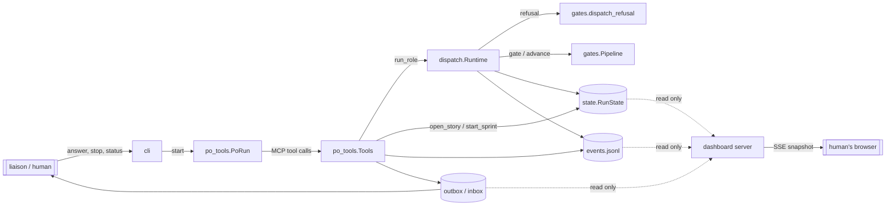
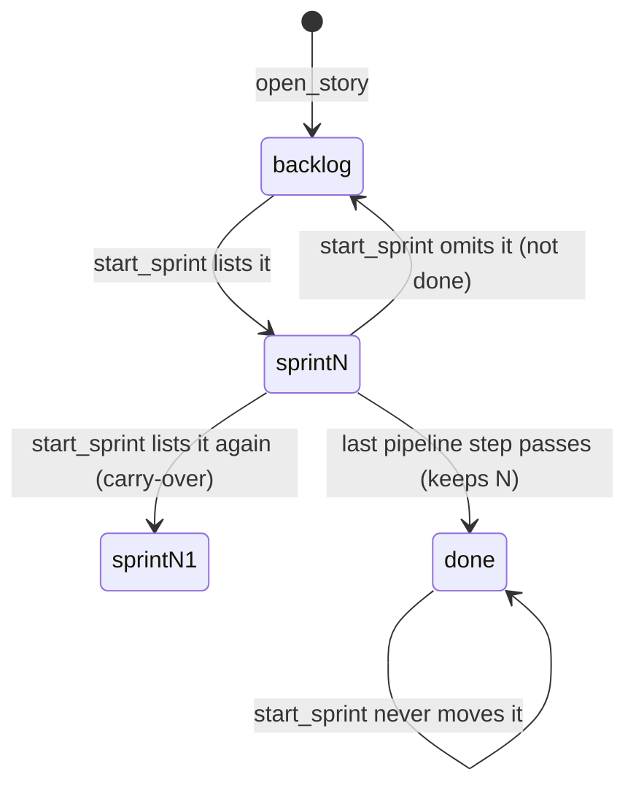
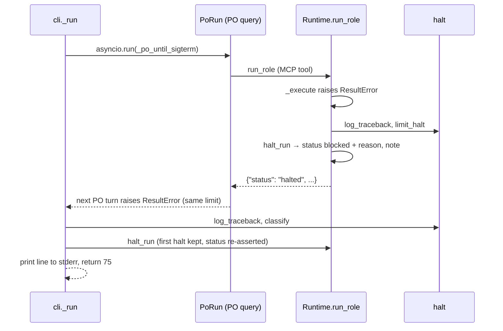
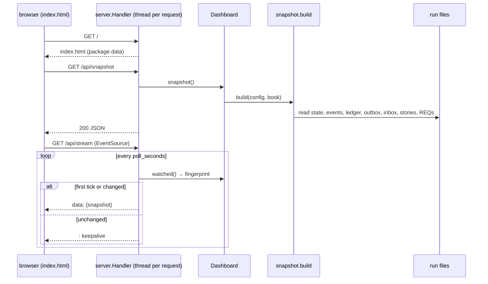

# agile-team runner: architecture

The runner (`agile-team/runner/agile_team/`) is the program that runs the team.
The skill (`agile-team/SKILL.md`) only drives its CLI. This document covers the
components, their boundaries and how data flows between them. The last
sections are per-story designs. Each one is the contract a developer
implements against and a reviewer checks against.

## Components

| Module | Owns | Talks to |
|---|---|---|
| `cli.py` | subcommands (`COMMANDS` table), `status_report`, top-level halt handling and SIGTERM | config, state, relay, ledger, halt, `po_tools.run_po` |
| `po_tools.py` | the PO's MCP tools (`Tools`, `SCHEMAS`) and the PO loop | `Runtime`, `RunState`, events, relay |
| `dispatch.py` | `Runtime`: refusal, planning, running and settling one role step; `halt_run` records a halt | gates, guard, sandbox, git, ledger, state, events, halt |
| `halt.py` | `Halt`, `HaltKind`, `HALTS`, `LIMIT_PATTERNS`: exception → halt; `crash.log` | state (`RunStatus`) |
| `gates.py` | `StoryState`, `Pipeline` (step machine), `dispatch_refusal`, command gates | roles (`Handoff`) |
| `state.py` | `RunState` and `state.json` load/save | gates (`StoryState`) |
| `events.py` | `events.jsonl` append-only log (`EventKind`) | none |
| `relay.py` | outbox/inbox with the liaison | none |
| `ledger.py` | per-step cost, budget checkpoints | none |
| `guard.py`, `sandbox.py`, `keys.py` | write scopes, quarantine, Customer Proxy sandbox, key hygiene | git |
| `roles.py`, `config.py` | role layering, handoff parsing, `.agile-team.toml` | none |
| `dashboard/snapshot.py` | `build(config, book)`: run files → one snapshot dict (read-only) | state, ledger, relay files, events file, story and requirement files, roles |
| `dashboard/server.py` | read-only HTTP + SSE server (`ThreadingHTTPServer`), `default_host`, `display_url` | snapshot (through `Dashboard`) |



### One role step

1. The PO calls `run_role(role, brief, story)`.
2. `Runtime.refusal` runs `_run_refusal`, `_role_refusal` and `_story_refusal`
   in order. The first reason wins and goes back to the PO as
   `{"status": "refused", "reason": …}`. No side effects happen before this point.
3. `plan` → `_execute` (a fresh `query()`) → `settle`: cost, handoff, quarantine
   and commit, gate, save.

Rule: refusals are pure checks. Any state change happens only after every
check has passed. This holds for every PO tool too.

## Requirements (interim)

Structured `REQ-NNN.md` files arrive with s1. Until then, each story design
below lists its rules (`B1`, `B2`, …). When s1 lands, these rules move into
REQ files. Do not add a free-form `requirements.md`: s1 treats one as a
legacy problem.

---

## s3: Backlog and sprint membership

Developer: **developer-cli** (runner Python: `gates.py`, `state.py`,
`po_tools.py`, plus the built-in `roles/product-owner.md`). The Architect has
already updated `reference/protocol.md`, `SKILL.md` and the README row
in this design step.

### Rules

| # | Rule |
|---|---|
| B1 | `StoryState.sprint: int \| None`. `None` means the story is in the backlog. A number is the sprint the story is committed to. |
| B2 | `open_story` puts a new story in the backlog (`sprint = None`). |
| B3 | `start_sprint(goal, stories)` is the **only** way into a sprint. Nothing else sets `sprint` to a number. |
| B4 | `start_sprint` replaces the sprint's scope. It opens sprint `N+1`. Every listed story that is not done gets `sprint = N+1`. Every other story that is not done goes back to the backlog (`None`). A done story never changes: it keeps the sprint it finished in (or `None` for legacy stories). |
| B5 | A story is in at most one sprint (a single int). Carrying an unfinished story over means listing it again. Adding a story mid-sprint means a new `start_sprint` that lists the old stories plus the new one. That starts sprint `N+1` and queues the Manager again. This is intended: sprint scope changes get a Manager review. |
| B6 | `start_sprint` refuses, with no side effects (sprint number, status, `manager_due`, state file and events all unchanged), when `stories` is missing or empty, or when any id is not an opened story. |
| B7 | A story-bound step on a backlog story is refused with exactly `story sN is in the backlog; add it to a sprint`. Ungated roles (`manager`, `scribe`) and story-less steps are unaffected. |
| B8 | `state.json` written before s3 has no `sprint` key on stories. Those stories load into the backlog (`None`). Nothing else changes: `step`, `rounds`, `status` and `commit` are kept. |
| B9 | `story_status` and `agile-team status` show each story's `sprint` (`null` = backlog) and the current sprint number. |

### Membership lifecycle



### Legacy state and self-hosting (B8)

Loading needs **no migration code**. `StoryState.sprint` has the default
`None` and comes last among the fields, so `StoryState(**data)` in
`state._story` fills it in when the key is missing. The rule needs no special
cases:

- A story already past design (say, at `implement` with a `commit`) keeps its
  step, rounds and commit. Once it is back in a sprint, it carries on where it
  was.
- The current sprint's stories are **not** inferred. The old state has no
  record of which stories the sprint held, and guessing "all of them" would
  silently commit the whole backlog.
- A story that is `needs_manager` or `blocked` and sits in the backlog still
  gets its status refusal first. The Manager can still rule on it, because
  `manager` is ungated.

What happens on the first `start --resume` after s3 (this repo's own run
included): the PO's next `run_role` on a story returns the backlog refusal.
The PO calls `start_sprint(goal, [unfinished ids])`, which opens sprint
`N+1` and queues the Manager. The PO runs the Manager, and work continues at
each story's existing step. The cost is one Manager step, and the refusal text
tells the PO what to do. A runner process that is already running keeps its
loaded code until it restarts.

### Changes by module

#### `gates.py`

- `StoryState`: add `sprint: int | None = None` as the **last** field, after
  `delivery`. Positional construction (`StoryState(id, title, step)`) and
  legacy loading depend on this.
- New `_backlog_refusal(story: StoryState) -> str | None`:
  returns `f"story {story.id} is in the backlog; add it to a sprint"` when
  `story.sprint is None`, else `None`.
- `dispatch_refusal` checks in this order: ungated role → no story → status
  → **backlog** → step:

  ```python
  return _status_refusal(story) or _backlog_refusal(story) or _step_refusal(role, story)
  ```

  Status comes first so that a done, blocked or capped story gives the more
  useful reason (a legacy done story says "is done", not "in the backlog").
  `dispatch.Runtime._story_refusal` already ends with `dispatch_refusal`, so
  it needs no change. B7 is met through it.

#### `state.py`

- `RunState.unknown_stories(self, ids: list[str]) -> list[str]`: the ids not
  in `self.stories`, in the order given.
- `RunState.begin_sprint(self, ids: list[str]) -> None`: increments
  `self.sprint`, then applies B4 to each story whose status is not `DONE`
  (`self.sprint` if its id is in `ids`, else `None`). It must stay at 8 lines
  or fewer.
- `from_json` / `_story`: unchanged (B8 holds through the dataclass default).

#### `po_tools.py`

`Tools.start_sprint` becomes refusal-check-then-act. Suggested split, each
function at most 8 lines and 2 parameters:

| Function | Job |
|---|---|
| `start_sprint(self, args)` | `ids = list(dict.fromkeys(args.get("stories") or []))` (dedupe, keep order); refuse via `_sprint_refusal`; else `_begin_sprint`; return the result. |
| `_sprint_refusal(self, ids) -> str \| None` | Applies B6 using the reason strings below. |
| `_begin_sprint(self, goal, ids) -> None` | `state.begin_sprint(ids)`; `status = RUNNING`; append the `manager_due` entry; `save()`; emit `SPRINT_START`. |

Successful result: `{"sprint": N, "stories": ids, "next": "run the manager"}`.

`manager_due` entry: `f"sprint {N} start: {goal} ({', '.join(ids)})"`. The
Manager uses it to check that the scope is realistic.

`SPRINT_START` event data: `{"sprint": N, "goal": goal, "stories": ids}`. This
matches `dashboard/fixtures/snapshot.json`.

`story_status` adds a top-level `"sprint": state.sprint`. The per-story
`sprint` already comes through `vars(s)`.

`SCHEMAS` entries:

```python
"open_story": (
    "Register a story; it starts in the backlog until start_sprint lists it.",
    {"id": str, "title": str, "delivery": str},
),
"start_sprint": (
    "Begin the next sprint with exactly the listed story ids; unfinished stories "
    "not listed go back to the backlog. The manager must run next.",
    {"goal": str, "stories": list},
),
```

#### Refusal strings (tests may assert them exactly)

| When | Reason |
|---|---|
| `stories` missing or empty | `no stories listed; pass the story ids this sprint commits to` |
| unknown ids | `unknown stories: s7, s9; open them with open_story first` (all unknown ids, comma-separated, in the order given) |
| step on a backlog story | `story s3 is in the backlog; add it to a sprint` |

#### `cli.py`

`status_report` already includes `"sprint"` (the current sprint) and
`asdict(story)`, so each story gains `sprint` automatically. No code change is
needed. Tests must cover it (B9).

#### `roles/product-owner.md` (built-in, developer-cli edits it)

Replace step 3 of "How you work" and add a "Backlog and sprints" section that
says:

- `open_story` puts a story in the backlog. Only stories in the current
  sprint can move. `run_role` refuses a backlog story with "story sN is in
  the backlog; add it to a sprint".
- `start_sprint(goal, stories=[…])` lists **every** story the sprint commits
  to, including unfinished ones carried over. Unfinished stories you leave
  out go back to the backlog. Then run the `manager`.
- To add a story mid-sprint, start a new sprint that lists the current
  stories plus the new one (the Manager reviews the change).
- After a resume, if `story_status` shows unfinished stories with
  `sprint: null`, start a sprint with the ones to continue.
- Sprint cadence: "the sprint's stories" means the stories whose `sprint`
  equals the current sprint.

### Test checklist (for the Unit Tester)

Existing helpers that build stories for steps must now put them in a sprint
(`sprint=1`): `tests/test_dispatch.py::open_story` and
`tests/test_gates.py::story`. `test_po_tools.py::test_start_sprint_requires_manager`
must open a story and pass `stories`. These are contract changes, not
weakened tests.

1. B1/B2: `open_story` stores `sprint is None`; `story_status` shows
   `"sprint": null` for it.
2. B8: `RunState.from_json` of a story dict without `sprint` gives `None`; a
   round trip keeps `sprint=2`.
3. B6: an empty list, a missing key and unknown ids are each refused. After
   each refusal, `state.sprint`, `status`, `manager_due` and the events log are
   unchanged. The unknown-ids reason names every unknown id.
4. B3/B4: given s1 in sprint 1 (unfinished), s2 done in sprint 1, s3 in the
   backlog, then `start_sprint(stories=["s3"])` → s3 = 2, s1 = `None`, s2 = 1.
   Listing a done story leaves its sprint unchanged.
5. B5: listing s1 again carries it to sprint 2. Duplicate ids appear once
   in the event and the result.
6. Event, `manager_due` entry and result have the shapes given above.
7. B7: `run_role` on a backlog story at its correct step is refused with the
   exact string. `manager` and `scribe` on a backlog story are not refused by
   it. A story-less architect step is not refused.
8. Order: a done backlog story says "is done"; a needs-manager backlog story
   says "round cap".
9. B9: `story_status` has the top-level `sprint`; `cli.status_report` stories
   carry `sprint`.

### Out of scope

Removing a single story from a sprint without starting a new one, and story
priority or ordering within the backlog, are both out of scope. So is
dashboard rendering, which is s4/s5: the snapshot fixture already carries
`stories[].sprint` and the `sprint-start` event's `stories`.

---

## s7: Customer Proxy forbidden roots in nested layouts (bug)

Developer: **developer-cli** (runner Python: `paths.py`, `sandbox.py`,
`guard.py`). The Architect has already updated `reference/protocol.md`
(Enforcement) in this design step. `SKILL.md` and the README do not describe
forbidden roots, so they do not change.

### Root cause

`paths.literal_root` keeps only the **first** path segment of a glob. In this
repo, all four source/tests/e2e globs (`agile-team/runner/agile_team/**`,
`…/scripts/**`, `…/tests/**`, `…/tests/e2e/**`) reduce to `agile-team`. This
causes two failures:

1. `guard._names_forbidden_root` compares only a Bash token's first segment,
   so the bare CLI name `agile-team` is denied.
2. `sandbox.os_sandbox_settings` emits `Read(/<repo>/agile-team/**)`, and that
   deny rule overrides the `allowRead` for `agile-team/docs/customer/`.

### Rules

| # | Rule | AC |
|---|---|---|
| P1 | A glob's **literal root** is its leading `/`-separated segments up to (not including) the first segment that contains `*`, `?`, `[` or `{`, joined by `/`, with no trailing `/`. A fully literal glob is its own root, even when it names a file. | AC1 |
| P2 | A glob starting with `!` has no root (`""`). A negation only narrows a set, so it never adds forbidden paths. A glob whose first segment holds a wildcard also has no root. | AC1 |
| P3 | `forbidden_roots(config)` = the non-empty literal roots of every glob under `source`, `tests` and `e2e`, deduplicated. A root that lies under another root is dropped. The result is sorted. | AC1 |
| P4 | A path is **under** a root when it equals the root or starts with `root + "/"`. `paths.under_root` is the single definition. The hook calls it, and the deny rules spell the same relation (P6). | AC1, AC2 |
| P5 | A Bash word names a forbidden root under the **Bash word rule** (W1–W6 below). It is one rule for every word, literal or wildcard. | AC2, AC3 |
| P6 | `os_sandbox_settings` emits two `permissions.deny` rules per root, in root order: `Read(/<repo>/<root>)` and `Read(/<repo>/<root>/**)`. (`<repo>` is absolute, so `/<repo>` gives Claude Code's `//abs` form, as today.) | AC1, AC3 |
| P7 | The `or ["src"]` fallback stays in `proxy_scope` only. An empty `bash_forbidden` turns off **all** sandboxed Bash checks (`..`, repo paths), so the Proxy must never get one. The deny rules get no fallback: the OS sandbox's `denyRead` on the whole repo already covers that case. | AC2 |

P3's nesting rule keeps flat layouts **byte-identical** to today. The python
preset gives `src`, `tests` and `tests/e2e`, which collapse to
`["src", "tests"]`. The node preset gives `["e2e", "lib", "src", "test"]` and
rust gives `["src", "tests"]`. For flat roots, the Bash word rule is at least
as strict as the old `head in roots` check. It also closes the old flat
wildcard hole (review P5: `cat s*/x`).

### Worked examples

| Glob | Literal root |
|---|---|
| `src/**` | `src` |
| `agile-team/runner/agile_team/**` | `agile-team/runner/agile_team` |
| `agile-team/runner/tests/e2e/**` | `agile-team/runner/tests/e2e` |
| `src/*.py` | `src` |
| `src/foo*/bar` | `src` |
| `src/[ab]/x` | `src` |
| `src/pkg/main.py` | `src/pkg/main.py` |
| `main.py` | `main.py` |
| `src/` | `src` |
| `**/*.py`, `*.py` | `""` |
| `!tests/e2e/**`, `!tests/**` | `""` |

This repo's `forbidden_roots`: `["agile-team/runner/agile_team",
"agile-team/runner/scripts", "agile-team/runner/tests"]` (`tests/e2e` is
nested, so it is dropped).

### Bash word rule (revised after review round 3)

This replaces the ae1a46a split into a literal branch and a wildcard branch
(`has_wildcard`, `token_prefix`, `_glob_reaches`). Every word goes through
the same steps.

**Property (what the reviewer checks).** A Proxy Bash word is denied when
the shell (bash or zsh, default options) could expand it to a forbidden root
or a path under one, reading that path from the repo root. Over-denying is
allowed. Any under-deny inside this property is a defect. The cases outside
it are listed under Known limits.

| # | Step | Rule |
|---|---|---|
| W1 | Unquote | Words come from `shlex.split`, which already removes quotes and `\`. If shlex can't parse the command, the fallback `command.split()` words have every `'`, `"` and `\` deleted. (Example: `cat "agile-team/runner/agile_team/cli.py" # it's` makes shlex fail.) |
| W2 | Climb | Deny when a `/`-segment of the raw word is `..` (as today). Also deny when a segment **other than the last** holds `{` or `(`, or starts with `.` and holds `*`, `?` or `[`. Such a segment could expand to `..` or to text that contains `/`. |
| W3 | Repo path | `_names_repo`, unchanged. |
| W4 | Normalise | `paths.normalise_token(word)` = `posixpath.normpath(word.lstrip("./"))`. This is the only normaliser, so `a//b`, `a/./b`, a leading `./` and a trailing `/` are handled the same way in every word (fixes review B1). The word and the roots are then compared after `casefold()`, because the default macOS filesystem ignores case. |
| W5 | Cwd glob | A normalised word made only of `*` and `?` characters (`*`, `**`, `?`) passes. It names entries of the cwd, the same as `.`. |
| W6 | Walk | Pair the word's segments with each root's segments, starting from the left. If the root runs out of segments first, the word **reaches** the root: deny. If the word runs out first, it names at most an ancestor: pass, the same as literal `agile-team/runner`. A word segment that holds `**` reaches the root (it can cross any number of segments). Any other segment is compared with the table below. A mismatch means the word does not reach that root. |

How a word segment `w` is compared with a root segment `r` (both casefolded):

| `w` holds | matches `r` when |
|---|---|
| `[`, `{` or `(` | always. W2 has already denied `{` and `(` in any segment but the last. |
| none of those | `fnmatchcase(r, w.replace("?", "*"))`. For a literal segment this is plain equality. Widening `?` to `*` makes `scripts?` count as naming `scripts`. |

Why this covers every case:

- **Leading `*`, `?`, `[`, `{`, `(`**: segment 0 is compared like any other
  segment (review B2). An empty literal prefix is no longer a special case.
- **Braces, and zsh `(a|b)` groups**: one of these can contain `/` or produce
  `..`. W2 therefore denies it outside the last segment. In the last segment it
  can't span a `/`, so it matches any one segment.
- **`**`** reaches the root (zsh `**/`, bash globstar).
- **No mismatch can be undone later.** After W2, no expansion has `..` in a
  segment before the last, because a glob only matches a leading `.` when the
  pattern spells that `.` out. A last segment that expands to `..` names the
  parent of a path that is not under any root. That parent is not under a root
  either.
- **Quotes** (W1). A quoted glob (`'agile_*'`) is treated as a glob, which can
  only over-deny.

Examples. N is this repo's roots (`agile-team/runner/{agile_team,scripts,tests}`).
F is the flat roots `["src", "tests"]`. Each command is run through
`guard.check_tool_use` with a Proxy `Scope`. Commands marked "over-deny" are
denied on purpose; that is safe.

| Roots | Command | Result | Step |
|---|---|---|---|
| N | `agile-team status`, `agile-team --help`, `which agile-team` | allow | W6: word runs out |
| N | `cat agile-team/docs/customer/x.md`, `ls agile-team/runner`, `cat agile-team/runner/testsuite` | allow | W6 |
| N | `cat agile-team/docs/*.md`, `cat agile-team/docs/customer/*`, `cat agile-team/docs/customer/{a,b}.md` | allow | W6: `docs` ≠ `runner` |
| N | `cat agile-team/README*`, `ls agile-team/*`, `cat .team/stories/*` | allow | W6 (`agile-team/*` names only ancestors; ae1a46a denied it) |
| N | `cat *.txt`, `cat ./*.txt`, `echo {1..3}` | allow | W6: word runs out |
| N | `ls *`, `ls ?`, `ls **` | allow | W5 |
| N | `cat agile-team/runner/agile_team/cli.py`, `cat agile-team/runner/agile_team`, `ls ./agile-team/runner/tests`, `ls agile-team/runner/tests/` | deny | W6 |
| N | `cat agile-team//runner/agile_team/x`, `cat agile-team/./runner/scripts/x`, `cat 'agile-team/runner/agile_team'/cli.py` | deny | W4, W6 |
| N | `cat agile-team/runner/agile_*/cli.py`, `cat agile-team/runner/agile_tea?/x`, `cat agile-team/runner/agile_tea[m]/x` | deny | W6 |
| N | `cat agile-team/*/agile_team/x`, `ls agile-team/**`, `cat agile-team/**/cli.py`, `cat agile-team/runner/*` | deny | W6 |
| N | `cat agile-team/runner/agile_team{,}/x`, `cat agile-team/runner/{agile_team,x}/cli.py` | deny | W2 |
| N | `cat agile-team/runner/tests/*`, `cat agile-team/runner/scripts?`, `cat a*/runner/agile_team/x`, `cat agile-team/run*/agile_team/x` | deny | W6 |
| N | `cat ./agile-team/runner/agile_*/x`, `cat agile-team//runner/agile_*/x`, `cat .//agile-team/runner/agile_*` | deny | W4, W6 |
| N | `cat 'agile-team/runner/agile_'*/cli.py`, `cat agile-team/runner/agile_\*/x` (over-deny) | deny | W1, W6 |
| N | `cat agile-team/./runner/agile_*/cli.py`, `cat agile-team/runner/./agile_*/cli.py`, `cat ./agile-team/./runner/agile_t*/cli.py` | deny | W4, W6 (review B1) |
| N | `cat {,}agile-team/runner/agile_team/cli.py` | deny | W2 (review B2) |
| N | `cat */runner/agile_team/cli.py`, `cat */*/agile_*/cli.py`, `cat ?gile-team/runner/agile_team/cli.py`, `cat [a]gile-team/runner/agile_team/x` | deny | W6 (review B2) |
| N | `cat {agile-team/runner,x}/agile_team/cli.py`, `cat agile-team/docs/{..,x}/runner/agile_team/cli.py`, `cat agile-team/docs/.*/runner/agile_team/cli.py` | deny | W2 |
| N | `cat agile-team/runner/(agile_team\|x)/cli.py`, `cat agile-team/runner/agile_tea(m)` | deny | W2, W6 (zsh) |
| N | `cat AGILE-TEAM/runner/agile_team/cli.py` | deny | W4 casefold |
| N | `cat "agile-team/runner/agile_team/cli.py" # it's` | deny | W1 fallback |
| N | `cat {docs,x}/a.md`, `ls **/*.md`, `cat .*/x`, `cat agile-team/runner/agile_tea[x]/y` | deny (over-deny) | W2, W6 |
| F | `ls *`, `ls ?`, `cat *.txt`, `cat tests.txt`, `ls srcfoo`, `ls .*` | allow | W5, W6 |
| F | `cat src/x`, `ls ./tests`, `ls tests/`, `cat src//x`, `cat SRC/x` | deny | W4, W6 |
| F | `cat s*/x`, `cat src*`, `cat */x`, `cat ?rc/x`, `cat [s]rc`, `cat {,}src` | deny | W6 |
| F | `cat {,}src/x` | deny | W2 |
| F | `echo {1..3}`, `ls [a-z]*` | deny (over-deny) | W6: a one-segment group or bracket matches the one-segment root |

(`\|` in the table is only Markdown escaping. The word under test is
`agile-team/runner/(agile_team|x)/cli.py`; shlex keeps it as one word.)

### Changes by module

#### `paths.py`

| Function | Spec |
|---|---|
| `literal_root(glob: str) -> str` | P1 and P2. Docstring: "The wildcard-free leading path of a positive glob; `""` for a `!` glob or one that starts with a wildcard." Suggested: return `""` for `!`; otherwise `"/".join(takewhile(_is_literal, glob.split("/"))).rstrip("/")`. Keep the name: it is still the glob's root, just deeper. |
| `_is_literal(segment: str) -> bool` | `True` when the segment has none of `TOKEN_WILDCARDS` (`*?[{`, as in ae1a46a). |
| `under_root(path: str, root: str) -> bool` (new, public) | P4: `path == root or path.startswith(f"{root}/")`. Docstring: "True when `path` is `root` or lies inside it." The Bash check no longer uses it, but `sandbox._nested` still does. |
| `has_wildcard`, `token_prefix` | Delete them; nothing calls them any more. `TOKEN_WILDCARDS` stays, used only by `_is_literal`. |
| `GROUP_CHARS = "{("`, `ANY_SEGMENT = "[{("`, `GLOB_CHARS = "*?["` | Data for W2 and the segment table. |
| `normalise_token(token: str) -> str` | W4: `posixpath.normpath(token.lstrip("./"))`. Docstring: "A shell word as a repo-relative path: leading `.`/`/` stripped, `//` and `/./` collapsed." |
| `could_climb(token: str) -> bool` | W2, on the raw word. Docstring: "True when a segment of the word could expand to `..` or span a `/`." |
| `reaches(token: str, root: str) -> bool` | W4 to W6. Normalise and casefold, apply the W5 exemption, then `_walk(word_segments, root_segments)`. Docstring: "True when the shell could expand the word to `root` or a path under it." |
| `_walk(word: list[str], root: list[str]) -> bool` | W6. Recursive or a loop, under 8 lines. Order of checks: root empty → `True`; word empty → `False`; `"**" in word[0]` → `True`; then `_segment_matches(word[0], root[0]) and _walk(word[1:], root[1:])`. |
| `_segment_matches(segment: str, root_segment: str) -> bool` | The segment table: `any(c in segment for c in ANY_SEGMENT) or fnmatchcase(root_segment, segment.replace("?", "*"))`. `fnmatch` is stdlib. |

#### `sandbox.py`

- Add a constant `ROOT_GLOB_KEYS = ("source", "tests", "e2e")` (data over
  inline tuples).
- `forbidden_roots(config) -> list[str]`: P3. Docstring: "The outermost
  literal roots of the source, tests and e2e globs; Bash may not name them,
  and the Proxy may not Read under them."
- New `_nested(root: str, roots: set[str]) -> bool`: `True` when another
  root in `roots` contains `root` (`under_root(root, other)` for some
  `other != root`).
- New `_deny_reads(repo: Path, root: str) -> list[str]`: the two P6 rules.
- `os_sandbox_settings`: `permissions.deny` becomes the flattened
  `_deny_reads` of every forbidden root. Nothing else in the dict changes.
- `proxy_scope`: unchanged (P7).
- Import `under_root` alongside `literal_root`.

#### `guard.py`

- `_tokens(command)`: W1. In the `ValueError` fallback, delete quote
  characters from each word:
  `[w.translate(UNQUOTE) for w in command.split()]`, with the module constant
  `UNQUOTE = str.maketrans("", "", "'\"\\")`.
- `_token_forbidden(scope, token)`: replace the inline `".." in
  token.split("/")` with `could_climb(token)` (W2). Keep the order: climb,
  then `_names_repo`, then `_names_forbidden_root`.
- `_names_forbidden_root(scope, token)`:
  `any(reaches(token, root) for root in scope.bash_forbidden)`. Delete the
  branch on `has_wildcard`.
- Delete `_glob_reaches`. Drop the imports that are no longer used:
  `posixpath`, `has_wildcard`, `token_prefix` and `under_root`. `re` stays,
  because `_SEGMENT_SPLIT` uses it.
- `_names_repo` does not change.

Every function stays under 8 lines, with at most 2 parameters and no flags.

### Test checklist (for the Unit Tester)

One contract change, which does not weaken any test:
`test_paths.py::test_literal_root` currently expects `("!tests/**", "tests")`.
Under P2 it becomes `("!tests/**", "")`. All other existing guard and sandbox
assertions must stay as they are and pass. That includes
`scope.bash_forbidden == ["src", "tests"]`, `ls ./tests` denied,
`Read(/{repo}/src/**)` in the deny list and `forbidden_roots == []` for
`**/*.py`.

1. P1/P2: every row of the "Worked examples" glob table, parametrized.
2. P4: `under_root` for `(a, a)` true, `(a/b, a)` true, `(ab, a)` false,
   `(a, a/b)` false, `(agile-team, agile-team/runner/agile_team)` false.
3. P3: a config with this repo's `[toolchain.globs]` (source, tests with the
   `!` line, e2e) gives exactly the three roots above. The python preset
   globs give `["src", "tests"]`. Duplicate globs give one root.
4. P6: for this repo's globs, `permissions.deny` is exactly the six rules
   (two per root, in root order) and does **not** contain
   `Read(/<repo>/agile-team/**)`. `allowRead` still holds the customer docs
   path.
5. P5: every row of the Bash word rule's example table, parametrized, through
   `guard.check_tool_use` on a Proxy `Scope`. Put the N rows in
   `test_nested_bash_tokens` and the F rows in `test_flat_layout_parity`.
   Unit tests in `test_paths.py` cover each step on its own:
   - `normalise_token`: `./a`, `a//b`, `a/./b`, `a/`, `""` → `.`.
   - `could_climb`: true for `..` in any position, `{a,b}/x`, `x/(a|b)/y`
     and `.*/x`. False for `{a,b}.md`, `x/{a,b}`, `.*`, `./x` and
     `.team/x`.
   - `reaches`: at least one row for each W5/W6 outcome (root runs out, word
     runs out, `**`, a segment from the any-segment table row, a `?` widened
     to `*`, a mismatch, casefold).
   Also test that the W1 fallback deletes quotes, through `check_tool_use`
   with `cat "agile-team/runner/agile_team/cli.py" # it's`.
   This step must cover all of the new wildcard code. The developer can't
   write tests, so these lines are only covered by this step.
6. Flat parity: with `["src", "tests"]`, `cat src/x`, `ls ./tests`,
   `ls tests/` and `cat src//x` are denied, and `cat tests.txt` and
   `ls srcfoo` are allowed.
7. AC3 end to end through `sandbox.proxy_scope` on a config shaped like this
   repo (`docs_dir = "agile-team/docs"`, its globs, a `package` delivery):
   Read of `agile-team/docs/customer/x.md` is allowed, Read of
   `agile-team/runner/agile_team/cli.py` is denied, Bash `agile-team status`
   is allowed and Bash `cat agile-team/runner/tests/test_x.py` is denied.

### Known limits (unchanged by s7, not in scope)

The root check is a name tripwire, not the wall. The wall is: cwd is the
sandbox (so relative paths resolve inside it), `..` and absolute repo paths
are denied, and the OS sandbox denies reading the repo. The Bash word rule's
property only covers words read as paths from the repo root. These cases fall
outside it and still pass the hook (backlog):

- Ancestors of a root, literal or glob (`ls agile-team/runner`,
  `ls agile-team/*`).
- Words glued to an option or a redirect (`--file=src/x`, `<src/x`)
  (review P2).
- Expansions the hook can't evaluate: `$VAR`, `$(…)`, backticks and `~`. This
  includes wildcard spellings of the absolute repo path
  (`/Users/*/code/claude-skills/…`) (review P1).
- Changes of cwd: `cd` with no argument (home), `cd /`, `cd {..,}`. After one
  of these, relative words no longer resolve from the sandbox (P1 family).
- zsh `EXTENDED_GLOB` operators (`^`, `~`, `#`). The option is off by default.

Deployment: a running runner keeps the old guard in memory. The fix applies
after `stop` then `start --resume`.

---

## s8: Clean stop on a usage limit, a crash or SIGTERM

Developer: **developer-cli** (runner Python: new `halt.py`, `cli.py`,
`dispatch.py`, `po_tools.py`, `state.py`, `relay.py`, plus the built-in
`roles/product-owner.md`). Decision record:
[`adr/ADR-001-clean-halt.md`](adr/ADR-001-clean-halt.md). The Architect has
already updated `reference/protocol.md` ("Run status and stops"), `SKILL.md`
(step 9), the README row, `guidelines.md` ("Errors and halts") and
`customer/stops-and-resume.md` in this design step.

### What the SDK gives us (checked in `claude_agent_sdk` 0.2.163)

- A limit arrives as `claude_agent_sdk.ResultError` (a `ProcessError`
  subclass, exported from the package root). `str(exc)` is
  `"Claude Code returned an error result: You've hit your session limit · resets 2:20pm (America/Edmonton)"`.
  It also has `.session_id`, `.result`, `.errors` and `.data` (the raw result
  payload, which includes `total_cost_usd` and `usage`). Just before raising,
  the SDK yields the same payload as a `ResultMessage(is_error=True)`.
- There is no limit-specific type or code, so detection matches the message
  text (H3).
- An exception inside `run_role` (an SDK MCP tool handler) is caught by the
  SDK and handed to the PO as an `isError` tool result. It does **not** reach
  `cli._run`, so the role-step path must catch the exception itself (H5).

### Rules

| # | Rule | AC |
|---|---|---|
| H1 | Every handled halt has one kind (`HaltKind`: `limit`, `crash`, `sigterm`). The `HALTS` table maps each kind to its run status, relay note kind, exit code and advice (table below). No code branches on the kind outside these tables. | AC1, AC2 |
| H2 | `classify(exc)` flattens `BaseExceptionGroup`s to their leaf exceptions. It then returns the first non-`None` result of `DETECTORS = (limit_halt, sigterm_halt, crash_halt)`. `crash_halt` always returns a halt. | AC2, AC3 |
| H3 | `limit_halt`: the first row of `LIMIT_PATTERNS` whose regex `search`es (case-insensitive) the leaf's message, for any leaf. The message is `str(leaf)` with the SDK's trailing ` (exit code: N)` removed (`EXIT_SUFFIX`, used only for limit matching; crash reasons keep it). The reason is `template.format(**match.groupdict())`, stripped. The reset text is copied from the match and never parsed or computed. It ends at a newline or a `;`, because the SDK joins `errors[]` with `"; "`. | AC1, AC3 |
| H4 | `sigterm_halt`: any leaf is an `asyncio.CancelledError` → `Halt(SIGTERM, "stopped by stop --now")`. `crash_halt`: `Halt(CRASH, f"crashed: {Type}: {first line of str(leaf)}")`, using the first leaf. The line is cut to 200 characters. With an empty message the reason is `crashed: {Type}`. | AC2 |
| H5 | **Role step.** `Runtime` wraps `_execute` in `except Exception`. Every caught exception is appended to `crash.log`. A limit (`limit_halt` is not `None`) → `halt_run`, then return the `halted` report to the PO (below). Anything else is re-raised unchanged, as today (the SDK hands its text to the PO). `CancelledError` is not an `Exception`, so it passes through to the top level. | AC1 |
| H6 | **Top level.** `cli._run` wraps `asyncio.run(...)` in `except (Exception, asyncio.CancelledError)`. It appends the traceback to `crash.log`, calls `runtime.halt_run(classify(exc))`, prints the halt line and returns the kind's exit code. `KeyboardInterrupt` is not caught there and keeps exit 130. | AC1, AC2 |
| H7 | **PO ended normally after a role-step halt.** If `runtime.halted_by` is set when `run_po` returns, `_run` prints the PO's text, then re-asserts the halt with `halt_run`, prints the halt line and returns its exit code. Otherwise it prints the text and returns 0, as today. | AC1 |
| H8 | `Runtime.halt_run(found) -> Halt`: the **first** halt in a process wins (`halted_by`). Every call sets `state.status` and `state.status_reason` from the winning halt and saves, so a later status write by a PO tool cannot hide it. The relay note is posted only on the first call. | AC1, AC2 |
| H9 | **SIGTERM.** Inside the event loop, `cli` installs `loop.add_signal_handler(signal.SIGTERM, task.cancel)` for the PO's main task. Cancellation unwinds `collect`, the SDK's subprocesses and `plan.stop()`. `asyncio.run` then raises `CancelledError`, and H6 handles it. `pid_file`'s `finally` removes `runner.pid`. | AC2 |
| H10 | `crash.log` (`.team/run/crash.log`) is append-only. Each entry is a header line `--- <YYYY-mm-dd HH:MM:SS> <ExceptionType>` followed by `traceback.format_exception(exc)`. Nothing else prints a traceback. | AC2 |
| H11 | **Resume.** `PoRun.run` calls `state.mark(RunStatus.RUNNING)` (no reason) before the PO's query starts. This clears `blocked`/`failed`/`stopped` and the stored reason, so `_run_refusal` does not refuse the resumed PO. `PoRun._record` sets `IDLE` only when the status is still `running`, and leaves any other status and its reason alone. | AC4 |
| H12 | **PO session on a PO-level error.** `PoRun._collect` catches `ResultError`, stores `exc.session_id or state.po_session` in `state.po_session`, saves, and re-raises. This way `start --resume` continues the session that hit the limit. | AC4 |
| H13 | `RunState.status_reason: str \| None = None` is added as the **last** field. Older `state.json` files load with `None`. `status_report` emits `"status_reason"` directly after `"status"`. | AC5 |
| H14 | `_run_refusal`'s halted text includes the reason when there is one: `the run is blocked (session limit, resets 2:20pm (America/Edmonton)); end your turn`. With no reason it is unchanged: `the run is blocked; end your turn`. | AC1 |
| H15 | **No settle after a halt.** `PoRun._settle` calls `settle_po` only when `runtime.halted_by` is `None`. After a halt the tree is left as it is (the cut-off role's partial edits and the PO's edits from that turn): nothing is committed, quarantined or attributed. Steps that finished earlier in the turn were already settled one by one. `_record` (cost, session) still runs. | AC1 |

### The `HALTS` table (exact values, tests may assert them)

| Kind | Status | Note kind | Exit | Advice |
|---|---|---|---|---|
| `limit` | `blocked` | `blocked` | 75 | ``run `agile-team start --resume` after the reset`` |
| `crash` | `failed` | `failed` | 70 | ``details in .team/run/crash.log; run `agile-team start --resume` to continue`` |
| `sigterm` | `stopped` | `stopped` | 143 | ``run `agile-team start --resume` to continue`` |

`Halt.message()` = `f"{reason}; {advice}"`. It is the relay note's text. The
printed line is `f"agile-team start: {message}"` on **stderr**, which matches
the CLI's existing error format. Example (limit):

```text
agile-team start: session limit, resets 2:20pm (America/Edmonton); run `agile-team start --resume` after the reset
```

The exit codes are 75 = `EX_TEMPFAIL` (try again later), 70 =
`EX_SOFTWARE` (internal error) and 143 = 128 + SIGTERM. The existing codes
stay: 0 (ok), 1 (CLI error or preflight), 130 (Ctrl-C).

### The `LIMIT_PATTERNS` table (start with these rows; a new phrasing is a new row)

| Regex (`re.IGNORECASE`) | Template | Example message → reason |
|---|---|---|
| `hit your (?P<kind>[\w ]+?) limit\W+resets (?P<reset>[^\n;]*[^\s;])` | `{kind} limit, resets {reset}` | `You've hit your session limit · resets 2:20pm (America/Edmonton)` → `session limit, resets 2:20pm (America/Edmonton)` |
| `hit your (?P<kind>[\w ]+?) limit` | `{kind} limit` | `You've hit your weekly limit` → `weekly limit` |
| `(?P<kind>usage) limit reached` | `{kind} limit reached` | `Claude AI usage limit reached\|1760000000` → `usage limit reached` |

Row order matters: the reset row comes first. `·` (U+00B7) is not a word
character, so `\W+` consumes ` · `.

### Flow



### Changes by module

#### `halt.py` (new)

Module docstring: "Why the runner stopped: turn an exception into a `Halt`,
and keep the traceback in `crash.log`."

| Name | Spec |
|---|---|
| `CRASH_LOG = "crash.log"` | File name under the run dir. |
| `SIGTERM_REASON = "stopped by stop --now"` | |
| `class HaltKind(StrEnum)` | `LIMIT = "limit"`, `CRASH = "crash"`, `SIGTERM = "sigterm"`. |
| `@dataclass(frozen=True) class HaltRule` | `status: RunStatus`, `note_kind: str`, `exit_code: int`, `advice: str`. |
| `HALTS: dict[HaltKind, HaltRule]` | The table above. |
| `@dataclass(frozen=True) class Halt` | `kind: HaltKind`, `reason: str`. `rule` property → `HALTS[self.kind]`. `message() -> str` → `f"{self.reason}; {self.rule.advice}"`. |
| `LIMIT_PATTERNS: tuple[tuple[re.Pattern[str], str], ...]` | The table above, compiled at import. |
| `leaves(exc) -> list[BaseException]` | `exc` itself, or the flattened leaves of a `BaseExceptionGroup` (recursive). |
| `EXIT_SUFFIX`, `_message(leaf) -> str` | H3: `str(leaf)` without the trailing ` (exit code: N)`. |
| `limit_halt(exc) -> Halt \| None` | H3. |
| `sigterm_halt(exc) -> Halt \| None` | H4. |
| `crash_halt(exc) -> Halt` | H4. |
| `DETECTORS = (limit_halt, sigterm_halt, crash_halt)` | |
| `classify(exc) -> Halt` | H2: `next(h for h in (d(exc) for d in DETECTORS) if h)`. |
| `log_traceback(run_dir: Path, exc: BaseException) -> None` | H10. Creates `run_dir` if needed. Uses only `traceback` and `time` from the stdlib. |

Keep each function at 8 lines or fewer. A private
`_limit_reason(text: str) -> str | None` that tries the rows against one
string keeps `limit_halt` short.

#### `state.py`

- `RunStatus`: add `FAILED = "failed"` and `STOPPED = "stopped"`. Docstring:
  "`sprint-end`, `blocked` and `done` are set by the PO's `notify_user`.
  `blocked`, `failed` and `stopped` are set by the runner when it halts (see
  `halt.HALTS`)."
- `RunState.status_reason: str | None = None`, last field (H13).
- `RunState.mark(self, status: RunStatus, reason: str | None = None) -> None`:
  sets both. Docstring: "Set the run status and why; no reason clears the
  old one."
- `halted()`: unchanged. `failed` and `stopped` only exist after the process
  has exited, and the next start resets them (H11).

#### `relay.py`

- `KINDS` gains `"failed"` and `"stopped"`, in that order after `"done"`.

#### `dispatch.py`

- Import `from . import halt` and `Halt`. Add the field
  `halted_by: Halt | None = field(default=None, init=False)` to `Runtime`.
- `run_role`: the last line becomes `return await self._run_planned(plan)`.
- `_run_planned(self, plan) -> dict[str, Any]` (new):
  `try: result = await self._execute(plan)`,
  `except Exception as exc: return self._step_failed(plan, exc)`, then
  `return self.settle(plan, result)`. `_execute` is unchanged: its
  `try/finally: plan.stop()` stays.
- `_step_failed(self, plan, exc) -> dict[str, Any]` (new): H5.
  `halt.log_traceback(...)`, `found = halt.limit_halt(exc)`. If `None`,
  `raise exc`. Otherwise `self.halt_run(found)` and return
  `halted_report(plan, found)`.
- `halt_run(self, found: Halt) -> Halt` (new, public): H8. Docstring:
  "Record the run's first halt (status, reason, liaison note); later calls
  re-assert it." The note is `Note(rule.note_kind, halted_by.message())`
  with no stories.
- Module function `halted_report(plan, found) -> dict[str, Any]` (next to
  `refused`):
  `{"status": "halted", "role": plan.role.name, "reason": found.reason, "next": "the run is stopping; end your turn"}`.
- `_run_refusal`: H14. A small helper `_halt_text(state) -> str` keeps it
  short.

#### `po_tools.py`

- `PoRun.run`: `self._set_status(RunStatus.RUNNING)` stays where it is,
  before the query (H11). `_set_status` now calls
  `state.mark(status)` and then `save()`. It replaces `await collect(...)`
  with `await self._collect(plan)`, and `settle_po()` with `self._settle()`.
- `PoRun._settle(self) -> None` (new): H15.
- `PoRun._collect(self, plan) -> StepResult` (new): H12. Docstring: "Drain
  the PO's query. On an SDK error result, keep its session for resume."
  Import `ResultError` from `claude_agent_sdk`.
- `PoRun._record`: H11. Record the ledger entry and `po_session` as today.
  Then `if state.status is RunStatus.RUNNING: state.mark(RunStatus.IDLE)`.
  Always save.
- `notify_user` and `_begin_sprint` keep assigning `state.status` directly.
  They do not touch `status_reason`, and H8 re-asserts any halt.

#### `cli.py`

| Function | Spec |
|---|---|
| `_run(runtime, start) -> int` | Inside `pid_file`, `try: result = asyncio.run(_po_until_sigterm(runtime, start))`, `except (Exception, asyncio.CancelledError) as exc: return _halt_exit(runtime, exc)`. After the `with`, `return _finish(runtime, result)`. |
| `async _po_until_sigterm(runtime, start) -> StepResult` | H9: get the running loop and `asyncio.current_task()`, call `add_signal_handler(signal.SIGTERM, task.cancel)`, then `return await run_po(runtime, start)`. The loop removes the handler when `asyncio.run` closes it. Unix only, as is the runner. |
| `_halt_exit(runtime, exc) -> int` | `halt.log_traceback(run_dir, exc)`, then `return _report(runtime.halt_run(halt.classify(exc)))`. |
| `_finish(runtime, result) -> int` | H7: print `result.text`. If `runtime.halted_by`, `return _report(runtime.halt_run(runtime.halted_by))`. Otherwise return 0. |
| `_report(found: Halt) -> int` | Print `f"agile-team start: {found.message()}"` to stderr and return `found.rule.exit_code`. |
| `status_report` | Add `"status_reason": st.status_reason` right after `"status"`. |

#### `roles/product-owner.md` (built-in; developer-cli edits it)

Add to "How you work" step 5: "On `halted`, the run is stopping (for
example, a usage limit). Make no more tool calls and end your turn. The
runner has already told the human."

### Test checklist (for the Unit Tester)

A new fake in `conftest.py`, `RaisingQuery(exc, before=1)`, yields `before`
`AssistantMessage`s and then raises `exc`, so the error comes mid-stream
(AC7). Build the limit error as the SDK does:
`ResultError("Claude Code returned an error result: You've hit your session limit · resets 2:20pm (America/Edmonton)", data={"subtype": "success", "is_error": True, "session_id": "po-sess", "result": "You've hit your session limit · resets 2:20pm (America/Edmonton)", "total_cost_usd": 1.5}, exit_code=1)`.
The real SDK always passes `exit_code`, which appends ` (exit code: 1)` to
`str(exc)`. Tests must not leave it out.

1. H3: every row of the `LIMIT_PATTERNS` table, parametrized, through
   `halt.classify`. Also a `BaseExceptionGroup` wrapping the limit error
   classifies as `limit`.
2. H4: `ValueError("boom\nmore")` gives `crashed: ValueError: boom`.
   `ValueError()` gives `crashed: ValueError`. A 500-character message is cut
   to 200 characters. `asyncio.CancelledError()` gives `sigterm`.
3. AC1, PO path: `cli._run` with a PO `RaisingQuery(limit)` returns 75. State
   has `blocked` and the reason
   `session limit, resets 2:20pm (America/Edmonton)`, and `po_session ==
   "po-sess"`. The outbox's last message is kind `blocked` with text
   ``session limit, resets 2:20pm (America/Edmonton); run `agile-team start --resume` after the reset``.
   Stderr is exactly the one line in the example. Stdout has no traceback.
   `crash.log` holds the traceback. `runner.pid` is gone.
4. AC1, role path: `Runtime.run_role` with a role `RaisingQuery(limit)`
   returns the `halted` report. State is `blocked` with the reason, and there
   is one `blocked` note. A second `run_role` is refused with
   `the run is blocked (session limit, resets 2:20pm (America/Edmonton)); end your turn`.
   `plan.stop()` still ran (use a prepared stub or a spy).
5. AC1, both paths in one run: a role-step limit, then the PO's query raises
   the same limit. Only one note is posted, and the exit code is 75.
6. H7: a role-step limit, then a PO that ends normally. `_run` prints the PO
   text and the halt line and returns 75. The status stays `blocked`, not
   `idle`.
7. H5: a role step raising `ValueError` propagates out of `run_role`
   unchanged. The status is unchanged, no note is posted, and the traceback is
   in `crash.log`.
8. AC2: a PO `RaisingQuery(RuntimeError("boom"))` gives exit 70, status
   `failed`, reason `crashed: RuntimeError: boom`, and a `failed` note.
9. AC2 SIGTERM: a fake PO query whose `action` calls
   `os.kill(os.getpid(), signal.SIGTERM)` and then awaits (for example
   `await asyncio.sleep(10)`) gives exit 143, status `stopped`, reason
   `stopped by stop --now`, a `stopped` note and no `runner.pid`.
10. AC4: with state `blocked` plus a reason, `run_po` in resume mode with a
    normal fake. The first role step is not refused. After the run the status
    is `idle` and `status_reason is None`. Do the same from `failed` and
    `stopped`.
11. H13/AC5: `RunState.from_json` without `status_reason` gives `None`, and a
    round trip keeps it. `cli.status_report` has `status_reason` right after
    `status` (check the key order).
12. H14: the refusal text without a reason is unchanged. Existing tests must
    still pass as they are.
13. H3: the limit text with a trailing ` (exit code: 1)`, and `errors[]`
    joined as `"<limit>; other error"` (and the reverse order), both give the
    exact AC1 reason.
14. H15: a halted role step writes one file inside the PO scope and one
    outside it, then raises the limit, and the PO ends its turn normally.
    Both files stay uncommitted, HEAD does not move, no `QUARANTINE` event is
    emitted, and the story's step and rounds are unchanged.

### How s9 and s10 plug in (not in s8's scope)

- **s9, in-flight step.** Record `state.in_flight = {role, story, brief}` in
  `run_role` after `STEP_START`, before `_run_planned`. `settle` clears it.
- **s9, saving an interrupted step's edits.** `Runtime.halt_run` is the
  single place every halt passes through (role-step limit, top-level crash,
  SIGTERM). s9 adds one call there: when `state.in_flight` is set, save the
  tree as a commit, then revert it, and put the sha into `state` and into the
  note text. At the top level the call runs after `asyncio.run` has returned,
  so the role's process is gone and the tree is quiet. H15 already makes sure
  nothing settles the tree after a halt, so the save sees the step's edits
  (and the PO's edits from that turn) as they were. Non-limit role-step
  exceptions that the PO keeps going after would need the same save in
  `_step_failed` before the re-raise. s9 decides that.
- **s9, status for a dead run.** Derive `interrupted` in `status_report`
  from `running` plus a missing or dead pid. With s8, a handled stop never
  leaves `running` behind. Only `kill -9` or a power loss does.
- **s10, PO spend.** `PoRun._collect` is the PO's except-and-re-raise seam.
  Widen it to `BaseException` and ledger the spend there. Sources: the
  `ResultMessage(is_error=True)` that the SDK yields **before** raising, or
  `ResultError.data["total_cost_usd"]` / `["usage"]`. For a role step, do
  the same in `_step_failed`. `collect` must keep the last `ResultMessage` it
  saw even when the iteration raises (for example, accumulate into an object
  owned by the caller).

### Known limits

- Ctrl-C is unchanged: exit 130, the status is left `running` (s9 derives
  `interrupted`).
- A limit phrased in a way no `LIMIT_PATTERNS` row matches is recorded as
  `failed`. The reason holds the message's first line, so the human still
  sees it. Add a row.
- If the SDK's subprocess cleanup itself hangs on cancellation, SIGTERM
  waits for it. A second `stop --now` does not escalate (no SIGKILL). The
  human can `kill -9`.

---

## s4: Dashboard backend (snapshot, read-only SSE server, CLI)

Developer: **developer-api**, alone, in one step. The work is runner Python:
new `dashboard/__init__.py`, `dashboard/snapshot.py`, `dashboard/server.py`,
plus small edits to `cli.py`, `config.py`, `ledger.py` and `state.py`. Every
developer specialization has the same write scope (`{source}`), so the CLI
row needs no second developer. The Architect has already updated
`reference/protocol.md` (CLI row, "Dashboard"), `SKILL.md` (step 5), the
README row, `guidelines.md` ("Dashboard") and `customer/dashboard.md` in this
design step. `index.html` is s5's and does not change here.

### The contract is the fixture, not the AC's section names

`dashboard/fixtures/snapshot.json` is the contract (AC3). It holds **raw**
sections, and the approved UI (`index.html`) derives the board, flow, tokens
and questions views from them in the browser. `build()` therefore returns the
fixture's ten top-level keys. AC1 and AC2 name views, and each one maps onto
those keys like this:

| AC view | Snapshot keys it comes from | Derived in `index.html` by |
|---|---|---|
| `run` | `run`, `pipeline`, `roles` | `renderHeader` |
| `board` | `stories` (`sprint: null` = backlog column; `step`, `status`, `rounds`), `pipeline` (the enabled steps = columns), `run.round_cap` | `renderBoard` |
| `flow` | `events` (briefs = `step-start`, handoffs = `step-end` by status, PO↔human = `message`/`answer`), `ledger` (tokens per role) | `flowStats`, `activeStep`, timeline (last 120 events) |
| `tokens` | `ledger` (by role, story, model; `at` for cumulative) | `totalsBy`, cumulative chart |
| `questions` | `messages` + `answers` (open relay questions), `step-end` `data.open_questions` (raised by a role) | `openQuestions`, `raisedQuestions` |
| `requirements` | `requirements` (status, covers, history), `stories[].acceptance` | `coverage`, `renderRequirements` |

The reviewer checks AC1 and AC2 through this table. No aggregation happens
in Python.

### Rules

| # | Rule | AC |
|---|---|---|
| D1 | `build(config, book) -> dict` returns exactly the keys `generated_at, run, pipeline, roles, stories, requirements, events, ledger, messages, answers`, in that order, with the shapes in the section table below. After a JSON round trip, the value types match the fixture. | AC1, AC3 |
| D2 | `build` only **reads** the files in the source table (`watched_files(config)` plus the role files already loaded into `book`). It never writes, never runs git, never touches the network and never reads key files. Pure apart from `time.time()` and file reads. | AC1, AC4 |
| D3 | A missing file or directory gives an empty section (`[]`) or the default (`RunState()`). A blank JSONL line, or one that does not parse as a JSON object, is skipped. The runner appends while the server reads, so a torn last line is normal. | AC1 |
| D4 | `roles`: every name in `book.names()`, sorted, resolved with `state.runtime_overrides(name)`, so a PO model override shows up. Disabled roles are left out. A role that raises `RoleError` is left out, not an error. | AC1 |
| D5 | `stories`: one row per `state.stories` entry, in state order. `opened_at` is the `at` of that story's first `story-opened` event (`None` if there is none). `acceptance` comes from the `acceptance` list in the frontmatter of `.team/stories/<id>.md`. If the file is missing, has no frontmatter or doesn't parse, it is `[]`. | AC1, AC2 |
| D6 | `requirements`: one row per `<docs>/requirements/REQ-*.md`, sorted by file name. The frontmatter gives `id` (default: the file stem), `title` (`""`), `status` (`"active"`), `covers` (`[]`). `text` is the body, stripped. `history` is that id's `requirement-changed` events in log order, each `{at, change, reason, role, story, sha}`, where `sha = data.get("sha", "")`. A file that doesn't parse still gets a row, with defaults and empty `text`, so the human can see it is broken. | AC1, AC2 |
| D7 | `events`: the `events.jsonl` objects as written (no `EventKind` parsing, so unknown kinds pass through). Each outbox message is merged in as `{"id": "out-<mid>", "at", "kind": "message", "role": "product-owner", "story": None, "data": {"message": "<mid>"}}`, and each inbox answer as `{"id": "in-<mid>", "at", "kind": "answer", "role": None, "story": None, "data": {"message": "<mid>"}}`. The result is sorted by `at` (stable). All events are kept; the UI shows the last 120. | AC2 |
| D8 | `ledger`: each `ledger.jsonl` line through `Entry.from_dict` then `asdict`, so lines written before token accounting get zero tokens. `messages` and `answers`: the outbox and inbox objects as written. | AC2 |
| D9 | `run`: `{status, sprint, cadence, task, budget_usd, manager_every_pct, round_cap, manager_due}` from `state` (`status` as its string value), `config.team` and `config.gates.round_cap`. `pipeline` = `list(config.gates.steps)`. `generated_at` = `time.time()`. | AC1 |
| D10 | `RunState.task: str = ""` is a new **last** field. `start` without `--resume` stores its `--task` there. `start --resume` leaves it unchanged, because its `--task` is a message to the PO, not the run's task. Older `state.json` files load with `""`. | AC1 |
| D11 | Server routes, matched on `urlsplit(path).path` **exactly**: `GET /` → `index.html` from package data; `GET /api/snapshot` → the snapshot JSON; `GET /api/stream` → SSE. Every other path is 404 (`/index.html`, `/api/snapshot/`, `/fixtures/snapshot.json` and `/.team/...` included). The server has no `do_POST`, `do_PUT` and so on, so other methods get the stdlib's 501. No file path is ever built from the request. | AC4 |
| D12 | SSE: each tick computes `fingerprint(watched())`. On the first tick, and whenever the fingerprint has changed since the last tick, it sends `data: <snapshot JSON on one line>\n\n`. On every other tick it sends the keepalive comment `: keepalive\n\n`. It then sleeps `poll_seconds` (1.0, injectable). The loop ends when a write raises `BrokenPipeError` or `ConnectionResetError`. | AC4 |
| D13 | `default_host()` is `"127.0.0.1"` when `sys.platform == "win32"` and `"0.0.0.0"` otherwise. `--host` overrides it. `display_url(host, port)` uses `socket.gethostname()` in place of an all-interfaces host (`0.0.0.0`, `""`), so the URL opens from another machine. No auth. | AC5 |
| D14 | CLI `dashboard [--host H] [--port 8765] [--no-open]`: binds first, then prints `dashboard: <url>` with `flush=True`, using the **bound** port (so `--port 0` prints the real one). Unless `--no-open` is given, it then opens the URL with `webbrowser.open`, then serves until interrupted. A bind failure exits 1 with `agile-team dashboard: cannot listen on H:P: <strerror>`. | AC5, AC6 |

### Section shapes (source → value)

| Key | Source files | Value |
|---|---|---|
| `generated_at` | none | `float` |
| `run` | `state.json`, `.agile-team.toml` | object (D9) |
| `pipeline` | `.agile-team.toml` | `[str]` |
| `roles` | role files (via `book`), `state.json` overrides | `[{name, model, provider}]` |
| `stories` | `state.json`, `events.jsonl`, `.team/stories/<id>.md` | `[{id, title, sprint: int\|null, delivery: str, step, status, rounds: int, opened_at: float\|null, acceptance: [{id, text}]}]`. `delivery` is `story.delivery or ""`. |
| `requirements` | `<docs>/requirements/REQ-*.md`, `events.jsonl` | `[{id, title, status, covers: [str], text, history: [{at, change, reason, role, story, sha}]}]` |
| `events` | `events.jsonl`, `outbox.jsonl`, `inbox.jsonl` | `[{id, at, kind, role, story, data}]` |
| `ledger` | `ledger.jsonl` | `[{role, model, cost_usd, story, at, tokens: {input, output, cache_read, cache_creation}}]` |
| `messages` | `outbox.jsonl` | `[{id, kind, text, stories, at}]` |
| `answers` | `inbox.jsonl` | `[{id, text, at}]` |

### How s1 and s2 plug in (not built yet)

- **s1** defines the story and requirement file formats. D5 and D6 read only
  the keys the fixture needs, through `roles.split_frontmatter` (PyYAML is
  already a dependency). If s1's parser lands in `requirements.py`, s1 may
  swap `_frontmatter` for it. Paths come from `Config.stories_dir` and
  `Config.requirements_dir` (new here), and s1 should use them too.
- **s2** says git trailers are the durable history and that there is no
  extra store (s2 AC3). The dashboard reads no git, so the
  `requirement-changed` event **is** the requirements log for the dashboard.
  Until s2 puts `sha` into that event's `data`, `history[].sha` is `""`. s2
  should add it there: one key, and the event keeps its other fields.
- Until s1 and s2 land, `requirements` is `[]` in this repo, and AC1 allows
  that.

### Data flow



### Changes by module

#### `config.py`

| Name | Spec |
|---|---|
| `STORIES_DIR = ".team/stories"`, `REQUIREMENTS_DIR = "requirements"` | Constants. |
| `Config.stories_dir` (property) | `self.repo / STORIES_DIR`. Docstring: "Where story files live." |
| `Config.requirements_dir` (property) | `self.repo / self.team.docs_dir / REQUIREMENTS_DIR`. Docstring: "Where `REQ-NNN.md` files live." |

#### `ledger.py`

- Add `LEDGER = "ledger.jsonl"` (moved from `cli.py`). `cli.py` imports it
  from `ledger`, so `cli.LEDGER` keeps working.

#### `state.py`

- `RunState.task: str = ""`, the **last** field, after `status_reason` (D10).
  No other change: `from_json` fills it in through the default.

#### `dashboard/__init__.py` (new)

Module docstring only: "Read-only live dashboard: snapshot builder and
server." This makes `dashboard` a package, so `importlib.resources` finds
`index.html`. Hatch already ships every file under `agile_team/`.

#### `dashboard/snapshot.py` (new)

Module docstring: "Turn the run's files into the one JSON snapshot the
dashboard renders. Read-only; the contract is `fixtures/snapshot.json`."

| Name | Spec |
|---|---|
| `RUN_FILES = (STATE_FILE, EVENTS, LEDGER, OUTBOX, INBOX)` | Imported names from `state`, `events`, `ledger` and `relay`. |
| `@dataclass(frozen=True) class RunFiles` | `config: Config`, `book: RoleBook`, `state: RunState`, `events: list[dict]` (raw `events.jsonl`). Docstring: "The inputs one snapshot reads, loaded once." |
| `RunFiles.load(config, book)` (classmethod) | `state_mod.load(config.run_dir)`, `read_jsonl(config.run_dir / EVENTS)`. |
| `SECTIONS: dict[str, Callable[[RunFiles], Any]]` | The ten keys in D1 order → `_generated_at`, `_run`, `_pipeline`, `_roles`, `_stories`, `_requirements`, `_events`, `_ledger`, `_messages`, `_answers`. |
| `build(config, book) -> dict[str, Any]` | `files = RunFiles.load(config, book)`; `return {key: section(files) for key, section in SECTIONS.items()}`. Docstring names the fixture as the contract. AC1 reads `build(config)`. The role book is the second argument because resolving roles needs the global layer under the home dir, which `Config` doesn't carry. |
| `watched_files(config) -> list[Path]` | `[run_dir / n for n in RUN_FILES]` + `sorted(stories_dir.glob("*.md"))` + `sorted(requirements_dir.glob("REQ-*.md"))`. Missing ones included (the fingerprint skips them). |
| `read_jsonl(path) -> list[dict]` | D3. `[]` when the file is missing. Uses a helper `_parse_line(line) -> dict \| None` that returns `None` for blank lines, `json.JSONDecodeError` and non-dict values. |
| `_generated_at(files)`, `_pipeline(files)`, `_run(files)` | D9. |
| `_roles(files)` / `_role(files, name) -> dict \| None` | D4. `_role` catches `RoleError` only. |
| `_stories(files)` / `_story(files, story) -> dict` | D5. `_story` spreads the fields listed in the shape table (not `asdict`, which would add `commit`). |
| `_opened_at(events, story_id) -> float \| None` | D5: `next((e["at"] for e in events if …), None)`. |
| `_acceptance(config, story_id) -> list[dict]` | D5. Each item is `{"id": str(a.get("id", "")), "text": str(a.get("text", ""))}`, and only dict items are kept. |
| `_frontmatter(path) -> tuple[dict, str]` | `({}, "")` for a missing file. Otherwise `roles.split_frontmatter(path.name, text)` with `None` meta → `{}`. Catches `yaml.YAMLError` and `RoleError` only and returns `({}, "")`. |
| `_requirements(files)` / `_requirement(path, history) -> dict` | D6. `history` is the dict from `_history`. |
| `_history(events) -> dict[str, list[dict]]` | D6. Only `kind == "requirement-changed"`, grouped by `data["id"]`. |
| `_events(files)` | D7: `sorted([*files.events, *map(_message_event, outbox), *map(_answer_event, inbox)], key=lambda e: e["at"])`. |
| `_message_event(message)`, `_answer_event(answer)` | D7 shapes. |
| `_ledger(files)`, `_messages(files)`, `_answers(files)` | D8. |

Every function stays at 8 lines or fewer with at most 2 parameters. Comment
the torn-line pitfall in `read_jsonl`.

#### `dashboard/server.py` (new)

Module docstring: "Read-only dashboard server: `/`, `/api/snapshot` and an
SSE stream, stdlib only. Never serves a directory."

| Name | Spec |
|---|---|
| `POLL_SECONDS = 1.0`, `DEFAULT_PORT = 8765` | |
| `KEEPALIVE = b": keepalive\n\n"` | |
| `HOSTS = {"win32": "127.0.0.1"}`, `ALL_INTERFACES = {"0.0.0.0", ""}` | Data for D13. |
| `INDEX = resources.files(__package__) / "index.html"` | Package data, read per request with `read_bytes()`. |
| `@dataclass(frozen=True) class Dashboard` | `snapshot: Callable[[], dict[str, Any]]`, `watched: Callable[[], list[Path]]`, `poll_seconds: float = POLL_SECONDS`. Docstring: "What the server shows and how often the stream polls." |
| `Dashboard.for_run(config, book)` (classmethod) | `cls(partial(snapshot.build, config, book), partial(snapshot.watched_files, config))`. |
| `fingerprint(paths) -> tuple[tuple[str, int, int], ...]` | `(str(p), st_mtime_ns, st_size)` for each existing path. A missing file is skipped (`FileNotFoundError` only). Docstring: "Changes when a watched file appears, disappears or is written." |
| `class DashboardServer(ThreadingHTTPServer)` | `__init__(self, address, app: Dashboard)` stores `self.app` and calls `super().__init__(address, Handler)`. `daemon_threads = True` (already the stdlib default; state it). |
| `class Handler(BaseHTTPRequestHandler)` | `do_GET(self)`: `ROUTES.get(urlsplit(self.path).path, _not_found)(self)`. `log_message` is a no-op (docstring: "Quiet: the dashboard runs in the background."). |
| `ROUTES: dict[str, Callable[[Handler], None]]` | `{"/": _index, "/api/snapshot": _snapshot, "/api/stream": _stream}` (D11). |
| `class Body(NamedTuple)` | `content_type: str`, `data: bytes`. |
| `_send(handler, body: Body) -> None` | 200, `Content-Type`, `Content-Length`, `Cache-Control: no-store`, then write. |
| `_index(handler)` | `_send(handler, Body("text/html; charset=utf-8", INDEX.read_bytes()))`. |
| `_snapshot(handler)` | `_send(handler, Body("application/json", json.dumps(app.snapshot()).encode()))`. |
| `_not_found(handler)` | `handler.send_error(404)`. |
| `_stream(handler)` | 200 with `Content-Type: text/event-stream` and `Cache-Control: no-store`, `end_headers()`, then `try: _pump(handler.wfile, handler.server.app)` `except (BrokenPipeError, ConnectionResetError): return`. |
| `_pump(out: BinaryIO, app: Dashboard) -> None` | D12 loop. `last = None`; each tick: `now = fingerprint(app.watched())`, write `sse_data(app.snapshot())` if `now != last`, else `KEEPALIVE`; `out.flush()`; `last = now`; `time.sleep(app.poll_seconds)`. |
| `sse_data(snap) -> bytes` | `f"data: {json.dumps(snap)}\n\n".encode()`. `json.dumps` without `indent` never emits a raw newline. |
| `default_host() -> str` | `HOSTS.get(sys.platform, "0.0.0.0")` (D13). |
| `display_url(host, port) -> str` | `f"http://{name}:{port}/"`, where `name` is `socket.gethostname()` if `host in ALL_INTERFACES`, else `host`. |
| `serve(server) -> None` | `with server: server.serve_forever()`. Ctrl-C propagates; `cli.main` already maps it to 130. |

HTTP/1.0 (the stdlib default) is fine for SSE: the stream has no
`Content-Length` and ends when the connection closes. Pass the stream as
`handler.wfile` to `_pump`, so a unit test can drive `_pump` with a fake
writer.

#### `cli.py`

| Name | Spec |
|---|---|
| `class Browser(StrEnum)` | `OPEN = "open"`, `SKIP = "skip"` (no boolean flag; like `StopMode`). |
| `@dataclass(frozen=True) class DashboardIO` | `browse: Callable[[str], object] = webbrowser.open`, `serve: Callable[[DashboardServer], None] = server.serve`. Docstring: "Side effects of `dashboard`, swappable in tests." Module constant `DEFAULT_IO = DashboardIO()` (ruff B008 forbids calling it in a default argument). |
| `DASHBOARD_ARGS` | `--host` (default `None`, help "address to bind (default: all interfaces; 127.0.0.1 on Windows)"), `--port` (`type=int`, default `server.DEFAULT_PORT`), `--no-open` (`store_const`, `dest="browser"`, `const=Browser.SKIP`, `default=Browser.OPEN`, help "do not open a browser"). |
| `COMMANDS` row | `Command("dashboard", "serve the read-only live dashboard (blocks; run in the background)", cmd_dashboard, DASHBOARD_ARGS)`, after `stop`. |
| `cmd_dashboard(args, io: DashboardIO = DEFAULT_IO) -> int` | `httpd = _dashboard_server(args)`; `url = server.display_url(*httpd.server_address[:2])`; `print(f"dashboard: {url}", flush=True)`; `if args.browser is Browser.OPEN: io.browse(url)`; `io.serve(httpd)`; `return 0`. Docstring: "Serve the read-only dashboard until interrupted." |
| `_dashboard_server(args) -> DashboardServer` | `place = Place.of(args)`, `config = _load_config(place.repo)`, `app = server.Dashboard.for_run(config, role_book(config, place.home))`, `address = (args.host or server.default_host(), args.port)`. Construct `DashboardServer(address, app)`; on `OSError as exc`, raise `CliError(f"cannot listen on {address[0]}:{address[1]}: {exc.strerror}")`. |
| `_record_task(state, start) -> None` | D10: `if start.mode is not StartMode.RESUME: state.task = start.task`. `cmd_start` calls it after the cadence line. `PoRun.run`'s status save persists it. |
| module docstring | Add `dashboard` to the first line's command list. |

`flush=True` matters: the liaison runs this in the background with stdout
going to a file. `serve_forever` blocks, so an unflushed URL never shows up.

### Test checklist (for the Unit Tester)

Put the new tests in `tests/test_snapshot.py`, `tests/test_server.py` and
`tests/test_cli.py`. Use the `configured` fixture's repo and a
`RoleBook.for_repo(repo, config.roles, tmp_path / "no-global")`. The
autouse `AGILE_TEAM_HOME` fixture already isolates the home dir.

**Snapshot**

1. **Fixture shape (AC3).** A helper `write_run(repo, fixture)` turns the
   fixture back into run files:
   - `.agile-team.toml`: `budget_usd = 20.0`, `manager_every_pct = 25`,
     `round_cap = 3`, the fixture's `pipeline` as `gates.steps`.
   - `state.json`: `run` fields, plus stories without `opened_at` and
     `acceptance`.
   - `events.jsonl`: the fixture events except kinds `message` and `answer`.
   - `ledger.jsonl`, `outbox.jsonl` (= `messages`) and `inbox.jsonl` (=
     `answers`).
   - `.team/stories/<id>.md`: frontmatter `id`, `title`, `acceptance`.
   - `<docs>/requirements/<id>.md`: frontmatter `id`, `title`, `status`,
     `covers`, and the `text` as the body.

   Then assert `shape(json.loads(json.dumps(build(config, book)))) ==
   shape(fixture)`. `shape` maps a dict to `{k: shape(v)}`, a list to the
   `frozenset` of `json.dumps(shape(item), sort_keys=True)` over its items,
   and a scalar to `type(v).__name__`. This way `int` vs `float` and `null`
   vs `str` count, and a list's mixed item shapes (stories with
   `sprint: 1` and `sprint: null`) must all appear. Also assert some exact
   values: `stories[*].acceptance`, `requirements` (`history` equal apart
   from `sha == ""`), `ledger`, `messages`, `answers` and `pipeline` equal
   the fixture's, and the top-level key order equals D1.
2. **Empty (AC1).** Config only, with no run files, story dir or
   requirements dir. All ten keys are present. `stories`, `requirements`,
   `events`, `ledger`, `messages` and `answers` are `[]`. `run` is
   `{"status": "idle", "sprint": 0, "task": "", "manager_due": [], …}`.
   `roles` is not empty (built-ins). Nothing is raised.
3. **Torn lines (D3).** `events.jsonl`, `ledger.jsonl` and `outbox.jsonl`
   each hold one good line, one blank line, a `[1]` line and a truncated
   `{"kind": "ga`. Each section has exactly the one good item.
4. **Ledger (D8).** A line without `tokens` gives four zero counts.
5. **Stories (D5).** No story file gives `acceptance == []`. Bad YAML
   frontmatter gives `[]`. No `story-opened` event gives
   `opened_at is None`. `delivery None` gives `""`. `commit` is not a key.
6. **Requirements (D6).** A file without frontmatter gets `id` = stem,
   `status` `"active"` and `text` = body. Bad YAML gives a row with
   defaults. History collects only that id's `requirement-changed` events,
   in order. `data.sha` is used when present, otherwise `""`.
7. **Roles (D4).** A state override (`architect` → `haiku`) shows in
   `roles`. `[roles.integration-tester] enabled = false` drops it. A
   config-only role extending an unknown role is dropped, with no error.
8. **Events (D7).** Outbox and inbox items are merged by `at` between log
   events, with ids `out-m1` / `in-m1` and the D7 shapes. Unknown event
   kinds pass through.
9. **`watched_files`.** It lists the five run files (present or not), the
   story `*.md` files and the `REQ-*.md` files, and nothing else (for
   example, not `api-key`).
10. **D10.** `RunState.from_json` without `task` gives `""`. `cmd_start`
    (non-resume) stores `--task`. `--resume --task X` keeps the old task.

**Server** (`DashboardServer(("127.0.0.1", 0), app)` with `serve_forever`
in a daemon thread, `shutdown()` + `server_close()` in the fixture's
teardown; `app = Dashboard(lambda: box["snap"], lambda: [watched_file],
poll_seconds=0.01)`)

11. `GET /` and `GET /?mock`: 200, `text/html`, and the body equals the
    package's `index.html` bytes.
12. `GET /api/snapshot`: 200, `application/json`, and the body parses to
    `box["snap"]`.
13. **404 (D11, no directory serving).** Parametrize over `/index.html`,
    `/api`, `/api/snapshot/`, `/api/stream/x`, `/fixtures/snapshot.json`,
    `/dashboard/`, `/.team/run/state.json`, `/../.team/run/api-key` and
    `/%2e%2e/api-key`. Send the raw path with `http.client` so it is not
    normalised. Also: `POST /` gives 501.
14. **SSE change push (D12).** Open `/api/stream` with `http.client` and a
    socket timeout of about 2 s. The headers have `text/event-stream`. The
    first `data:` line equals the snapshot. Then change `box["snap"]` and
    rewrite the watched file with different content, bumping its mtime with
    `os.utime(..., ns=…)`. Within the timeout, a later `data:` line carries
    the new snapshot, and at least one `: keepalive` line has arrived.
15. **`_pump` unit.** A fake writer that raises `BrokenPipeError` on its
    second `write` makes `_stream`'s handling end cleanly. Drive `_stream`
    with a stub handler (`wfile`, `server.app`, `send_response`,
    `send_header` and `end_headers` recorders), or test `_pump` raising and
    `_stream` returning. Do the same with `ConnectionResetError`.
16. `fingerprint`: a missing path is skipped. The result changes when a
    file's size or `mtime_ns` changes and when a file appears.
17. **D13.** `default_host()` with `sys.platform` monkeypatched to `"win32"`
    gives `127.0.0.1`, and with `"linux"` or `"darwin"` gives `0.0.0.0`.
    `display_url("0.0.0.0", 8765)` with `socket.gethostname` monkeypatched
    to `labbox` gives `http://labbox:8765/`. `display_url("127.0.0.1", 9)`
    gives `http://127.0.0.1:9/`.
18. `serve` returns after `shutdown()` is called from another thread.

**CLI**

19. Parser: `dashboard` defaults to `host None`, `port 8765`,
    `browser OPEN`. `--no-open` gives `SKIP`.
20. **AC6 `--port 0`.** `main`-level or `cmd_dashboard(args, DashboardIO(browse=urls.append, serve=lambda s: s.server_close()))`
    with `--host 127.0.0.1 --port 0` returns 0. Stdout is exactly
    `dashboard: http://127.0.0.1:<p>/` with `p != 0`, and `urls == [that
    url]`. With `--no-open`, `urls == []`.
21. Default host: with `sys.platform` monkeypatched to `"win32"` and no
    `--host`, the bound address is `127.0.0.1`.
22. Port in use: bind a socket on `127.0.0.1:<p>`, then `main([... ,
    "dashboard", "--host", "127.0.0.1", "--port", str(p), "--no-open"])`
    returns 1. Stderr starts with `agile-team dashboard: cannot listen on
    127.0.0.1:<p>:`.
23. No `.agile-team.toml`: exit 1 with the existing config error.

### Known limits (accepted for lab use)

- No auth and no TLS. Anyone on the network who can reach the port sees the
  run: task, stories, questions and spend, but never keys. On Windows the
  default host is localhost.
- Each snapshot re-reads every file, and the stream sends the whole snapshot
  on each change. That is fine at the size of a run. Paging or deltas are
  out of scope.
- Role files and `.agile-team.toml` are read once at start, so a config or
  role edit needs a dashboard restart. Model overrides from the PO do show
  live (D4).
- A requirement retired by deleting its file disappears from `requirements`
  (its history remains in the events).
- `/?mock` served by the server gets 404 for `fixtures/snapshot.json`. Mock
  replay is for opening `index.html` as a file.

## s5: Dashboard live UI (tabs over the s4 snapshot)

Developer: **developer-gui**, alone. It edits only
`runner/agile_team/dashboard/index.html` and adds
`tests/test_dashboard_ui.py`. s4's server, routes and snapshot contract
(D1–D14, `fixtures/snapshot.json`) **do not change**. s5 needs no contract
change. Before writing the charts, the developer loads the `dataviz` skill
(AC5).

The starting point is the approved mock (`index.html` at 626d4663). It
already holds the tabs, CSS tokens, board, tokens, questions, requirements,
timeline, mock replay and the live boot. Keep all of that. Only the
differences below are s5 work. Each one is a rule a reviewer can check.

### Rules

| # | Rule | AC |
|---|---|---|
| U1 | **Boot.** Outside mock mode, `boot()` fetches `api/snapshot` (relative URL), checks `res.ok`, renders, then calls `connectLive()`. If the fetch fails or isn't ok, it does **not** show a fatal error. It sets `data.conn = "reconnecting…"` and still calls `connectLive()`, because the stream's first tick sends the full snapshot (D12). | AC1 |
| U2 | **Stream and reconnect.** `connectLive()` opens `new EventSource("api/stream")`. `onopen` sets `conn = "live"` and resets the backoff to 1 s. `onmessage` parses the snapshot, normalizes it (U4) and renders it. A bad JSON payload is ignored: keep the last snapshot. `onerror` sets `conn = "reconnecting…"`. If `es.readyState === EventSource.CLOSED`, the browser has given up, so it closes `es`, waits `backoff` with `setTimeout(connectLive, backoff)`, and doubles the backoff up to 10 s. Otherwise it lets EventSource retry by itself. There is never more than one open EventSource. After a server restart, the first `data:` line brings a full snapshot, so no refetch is needed. | AC1 |
| U3 | **Rendering.** Every pushed snapshot re-renders the header and the visible tab (`RENDER[ui.tab]`). `RENDER.flow` is `renderFlowTab` = `renderFlow` + `renderTimeline`, so Flow is no longer rendered while it is hidden (Mermaid lays out wrong in `display:none`). Each renderer call is wrapped by `safely(fn, view)`. A throw puts one `pill("render error: …", "critical")` in the status row, and the other panels and the stream keep going. `timelineRow` also catches errors per row and drops the row that threw. | AC1 |
| U4 | **Empty state.** `normalize(snap)` gives every list key of D1 (`pipeline, roles, stories, requirements, events, ledger, messages, answers`) the default `[]` when it is missing or not an array. `run` gets `{}`, merged over `{status: "idle", sprint: 0, task: "", budget_usd: 0, manager_every_pct: 25, round_cap: 3, manager_due: []}`. `story.acceptance`, `requirement.covers` and `requirement.history` also default to `[]`. Every panel with no rows shows one `<p class="empty">` line instead of an empty table or chart. Optional fields render only when they are non-empty: `history[].sha` (it is `""` until s2), `story.delivery`, and a step-end's `data.commit`, `data.tokens` and `data.cost_usd`. | AC1, AC6 |
| U5 | **Requirements empty state.** When `view.requirements` is empty, the Requirements tab shows only one card: "No requirements yet. The Architect writes them as `<docs>/requirements/REQ-NNN.md`." There are no tiles, no matrix and no gap pills. The tab badge is 0, and story cards hide "AC x/y traced". In this repo that is the expected state until s1 and s2 land. Once the list has one row, the mock's full view applies. | AC6 |
| U6 | **Flow is Mermaid.** It replaces the mock's hand-drawn SVG ring and its pulse animation (`FLOW`, `ringPositions`, `edgePath`, `flowEdges`, `flowNode`, `roleNode`, `PULSE_PATH` and `pulse` are removed, along with the "message in flight" legend item). `MERMAID_URL = "https://cdn.jsdelivr.net/npm/mermaid@11.4.1/dist/mermaid.esm.min.mjs"` is loaded once, lazily, with dynamic `import()`. The page script stays a classic `<script>`. It calls `initialize({startOnLoad: false, securityLevel: "strict", theme: "base", themeVariables})`, where the variables are read from the CSS tokens through `getComputedStyle` (`--surface`, `--ink`, `--axis`, `--accent`). | AC3, AC7 |
| U7 | **Flow source.** `flowSource(view)` is a pure function that returns the Mermaid text: `flowchart TB`; the node `you(["You (via liaison)"])`; the node `po["Product Owner<br/>model · tokens"]`; and one node `r<i>` per `ringRoles(view)` role, labelled `name<br/>model · tokens`, plus `<br/>↩ n bounced` when it has bounces. Edges are added only for counts > 0, in this order: per role, `po -->│"n briefs"│ r<i>`, then `r<i> -->│"n handoffs"│ po`; then `po -->│"n messages"│ you` and `you -->│"n answers"│ po`. After the edges come `linkStyle <k> stroke-width:<weight(n,max)>px,stroke:<color>` (brief `--ink-2`, handoff `--s1`, human `--s2`, as literal colours). Then come `classDef active stroke:<accent>,stroke-width:3px` and `classDef idle opacity:0.55`, and `class` lines: the active step's role (`activeStep`) gets `active`, or `po` gets it when no step is open; roles with no stats get `idle`. Every label goes through `mmdText(s)`, which replaces `"` with `#quot;` and `<`/`>` with `#lt;`/`#gt;`. Node ids are generated, never role names. (`│` stands for `|` here.) | AC3 |
| U8 | **Flow render.** `renderFlow` keys a memo on `source + theme`. If the key hasn't changed, it does nothing. Otherwise it calls `mermaid.render("flow-svg-<seq>", source)` and writes the SVG only if `seq` is still the latest (an async race guard). If the import or the render fails, `#flow` shows `<p class="empty">Flowchart unavailable (mermaid could not load).</p>` followed by `<pre>` with the source, and the timeline still renders. A theme change clears the memo. | AC3, AC7 |
| U9 | **Timeline.** It is the mock's timeline, unchanged: the last 120 events, newest first, each row a lane `from → to`, plus a story filter. It sits beside the chart in `.grid-flow`. This is the swimlane AC3 asks for. | AC3 |
| U10 | **Board.** It is the mock's board, unchanged: Backlog, one column per `pipeline` step, then Done. Cards show the rounds dots against `round_cap`, `⚑ needs manager`, `escalated` (`blocked`) and `? waiting on <qid>`. | AC4 |
| U11 | **Tokens by role, story and model.** The "Tokens by role" card becomes "Tokens by", with a three-button segmented control (`data-group="role\|story\|model"`, `aria-pressed`) stored in `ui.group` (default `"role"`). `renderMix` becomes `renderBars(view)`, using `totalsBy(view.ledger, ui.group)`. The stacked bars, legend and tooltip stay as they are. A null story groups as `(no story)`. The cumulative chart (`renderSpend`) is unchanged. | AC5 |
| U12 | **Questions.** Open relay questions are as in the mock. In each raised question's head, the bold role becomes the text `raised by <role>`. "Not yet asked" means `raisedQuestions` drops any question whose trimmed text equals the trimmed `text` of some message in `view.messages`. A question the PO reworded still shows (known limit). | AC6 |
| U13 | **Themes.** The colours come only from the existing CSS tokens. The `prefers-color-scheme` media block and the ◐/☀/☾ override stay. No new hex colours go outside `:root` blocks. | AC7 |
| U14 | **Outside URLs.** The only outside URL in the page is `MERMAID_URL`. There is no other `<script src>`, stylesheet, font or fetch to another origin, and there is no build step. | AC3, guidelines |

### Data flow (browser side)

```mermaid
sequenceDiagram
  participant P as index.html
  participant S as s4 server
  participant C as cdn.jsdelivr.net
  P->>S: GET api/snapshot
  S-->>P: snapshot → normalize → render header + visible tab
  P->>S: EventSource api/stream
  loop every change (D12)
    S-->>P: data: snapshot → normalize → render
  end
  Note over P,S: error: CLOSED → retry after 1,2,4…10 s; else browser retries
  P->>C: import(mermaid@11.4.1) once, on the first Flow render
```

### Test plan (`tests/test_dashboard_ui.py`, stdlib only, no new deps)

Load the page with `resources.files("agile_team.dashboard").joinpath("index.html").read_text()`.
This also proves the page ships as package data. Parse it with an
`html.parser.HTMLParser` subclass that collects `id`s and `<script>` text.

1. **Packaged.** The resource `is_file()`. s4's test 11 already checks
   that `GET /` serves exactly these bytes.
2. **Routes.** The script contains `fetch("api/snapshot")`,
   `new EventSource("api/stream")` and `EventSource.CLOSED` (U1, U2).
3. **One element per tab.** The ids include `tab-flow`, `tab-board`,
   `tab-tokens`, `tab-questions` and `tab-requirements`, and also `tabs`,
   `flow`, `timeline`, `board`, `spend`, `mix`, `q-open`, `q-raised`,
   `matrix` and `reqs`.
4. **Pinned Mermaid only (U14).** Every match of `https?://[^"'\s)]+` is
   either the U6 `MERMAID_URL` or starts with `http://www.w3.org/`.
   `mermaid@11.4.1` appears, and no other `mermaid@` version does.
5. **Themes (U13).** The page contains `prefers-color-scheme: dark` and
   `data-theme`.
6. **Empty-state copy (U5).** The page contains the U5 sentence "No
   requirements yet".
7. **JS syntax (optional).** `@pytest.mark.skipif(shutil.which("node") is
   None)`: write each inline script to `tmp_path/x.js` and run
   `node --check` through `subprocess.run`. The return code must be 0.
   Node is not a dependency, and coverage counts only `agile_team`, so the
   skip doesn't change coverage.

Manual check (Integration Tester / Customer Proxy): run `agile-team
dashboard --port 0 --no-open`, open the URL and touch `.team/run/events.jsonl`.
The page updates without a refresh. Then stop and restart the server on the
same port: the pill goes "reconnecting…" and back to "live". Open `/?mock`
from the file to replay the fixture through every tab.

### Known limits

- Without internet access the Flow chart shows its source text instead of
  the diagram (U8). The other tabs work offline.
- A dynamic `import()` can't carry Subresource Integrity. The pinned
  version is the only control.
- U12 matches by exact text, so a question the PO reworded still shows as
  raised.
