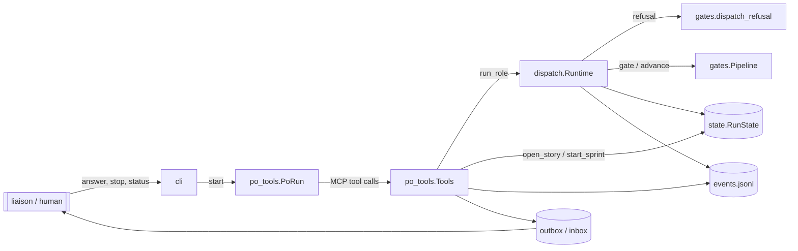
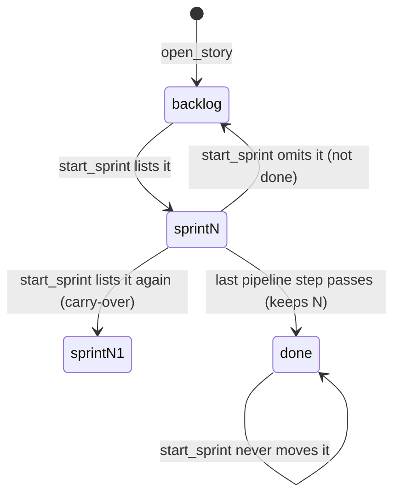

# agile-team runner: architecture

The runner (`agile-team/runner/agile_team/`) is the program that runs the team.
The skill (`agile-team/SKILL.md`) only drives its CLI. This document covers the
components, their boundaries and how data flows between them. The last
sections are per-story designs. Each one is the contract a developer
implements against and a reviewer checks against.

## Components

| Module | Owns | Talks to |
|---|---|---|
| `cli.py` | subcommands (`COMMANDS` table), `status_report` | config, state, relay, ledger, `po_tools.run_po` |
| `po_tools.py` | the PO's MCP tools (`Tools`, `SCHEMAS`) and the PO loop | `Runtime`, `RunState`, events, relay |
| `dispatch.py` | `Runtime`: refusal, planning, running and settling one role step | gates, guard, sandbox, git, ledger, state, events |
| `gates.py` | `StoryState`, `Pipeline` (step machine), `dispatch_refusal`, command gates | roles (`Handoff`) |
| `state.py` | `RunState` and `state.json` load/save | gates (`StoryState`) |
| `events.py` | `events.jsonl` append-only log (`EventKind`) | none |
| `relay.py` | outbox/inbox with the liaison | none |
| `ledger.py` | per-step cost, budget checkpoints | none |
| `guard.py`, `sandbox.py`, `keys.py` | write scopes, quarantine, Customer Proxy sandbox, key hygiene | git |
| `roles.py`, `config.py` | role layering, handoff parsing, `.agile-team.toml` | none |



### One role step

1. The PO calls `run_role(role, brief, story)`.
2. `Runtime.refusal` runs `_run_refusal`, `_role_refusal` and `_story_refusal`
   in order. The first reason wins and goes back to the PO as
   `{"status": "refused", "reason": …}`. No side effects happen before this point.
3. `plan` → `_execute` (a fresh `query()`) → `settle`: cost, handoff, quarantine
   and commit, gate, save.

Rule: refusals are pure checks. Any state change happens only after every
check has passed. This holds for every PO tool too.

## Requirements (interim)

Structured `REQ-NNN.md` files arrive with s1. Until then, each story design
below lists its rules (`B1`, `B2`, …). When s1 lands, these rules move into
REQ files. Do not add a free-form `requirements.md`: s1 treats one as a
legacy problem.

---

## s3: Backlog and sprint membership

Developer: **developer-cli** (runner Python: `gates.py`, `state.py`,
`po_tools.py`, plus the built-in `roles/product-owner.md`). The Architect has
already updated `reference/protocol.md`, `SKILL.md` and the README row
in this design step.

### Rules

| # | Rule |
|---|---|
| B1 | `StoryState.sprint: int \| None`. `None` means the story is in the backlog. A number is the sprint the story is committed to. |
| B2 | `open_story` puts a new story in the backlog (`sprint = None`). |
| B3 | `start_sprint(goal, stories)` is the **only** way into a sprint. Nothing else sets `sprint` to a number. |
| B4 | `start_sprint` replaces the sprint's scope. It opens sprint `N+1`. Every listed story that is not done gets `sprint = N+1`. Every other story that is not done goes back to the backlog (`None`). A done story never changes: it keeps the sprint it finished in (or `None` for legacy stories). |
| B5 | A story is in at most one sprint (a single int). Carrying an unfinished story over means listing it again. Adding a story mid-sprint means a new `start_sprint` that lists the old stories plus the new one. That starts sprint `N+1` and queues the Manager again. This is intended: sprint scope changes get a Manager review. |
| B6 | `start_sprint` refuses, with no side effects (sprint number, status, `manager_due`, state file and events all unchanged), when `stories` is missing or empty, or when any id is not an opened story. |
| B7 | A story-bound step on a backlog story is refused with exactly `story sN is in the backlog; add it to a sprint`. Ungated roles (`manager`, `scribe`) and story-less steps are unaffected. |
| B8 | `state.json` written before s3 has no `sprint` key on stories. Those stories load into the backlog (`None`). Nothing else changes: `step`, `rounds`, `status` and `commit` are kept. |
| B9 | `story_status` and `agile-team status` show each story's `sprint` (`null` = backlog) and the current sprint number. |

### Membership lifecycle



### Legacy state and self-hosting (B8)

Loading needs **no migration code**. `StoryState.sprint` has the default
`None` and comes last among the fields, so `StoryState(**data)` in
`state._story` fills it in when the key is missing. The rule needs no special
cases:

- A story already past design (say, at `implement` with a `commit`) keeps its
  step, rounds and commit. Once it is back in a sprint, it carries on where it
  was.
- The current sprint's stories are **not** inferred. The old state has no
  record of which stories the sprint held, and guessing "all of them" would
  silently commit the whole backlog.
- A story that is `needs_manager` or `blocked` and sits in the backlog still
  gets its status refusal first. The Manager can still rule on it, because
  `manager` is ungated.

What happens on the first `start --resume` after s3 (this repo's own run
included): the PO's next `run_role` on a story returns the backlog refusal.
The PO calls `start_sprint(goal, [unfinished ids])`, which opens sprint
`N+1` and queues the Manager. The PO runs the Manager, and work continues at
each story's existing step. The cost is one Manager step, and the refusal text
tells the PO what to do. A runner process that is already running keeps its
loaded code until it restarts.

### Changes by module

#### `gates.py`

- `StoryState`: add `sprint: int | None = None` as the **last** field, after
  `delivery`. Positional construction (`StoryState(id, title, step)`) and
  legacy loading depend on this.
- New `_backlog_refusal(story: StoryState) -> str | None`:
  returns `f"story {story.id} is in the backlog; add it to a sprint"` when
  `story.sprint is None`, else `None`.
- `dispatch_refusal` checks in this order: ungated role → no story → status
  → **backlog** → step:

  ```python
  return _status_refusal(story) or _backlog_refusal(story) or _step_refusal(role, story)
  ```

  Status comes first so that a done, blocked or capped story gives the more
  useful reason (a legacy done story says "is done", not "in the backlog").
  `dispatch.Runtime._story_refusal` already ends with `dispatch_refusal`, so
  it needs no change. B7 is met through it.

#### `state.py`

- `RunState.unknown_stories(self, ids: list[str]) -> list[str]`: the ids not
  in `self.stories`, in the order given.
- `RunState.begin_sprint(self, ids: list[str]) -> None`: increments
  `self.sprint`, then applies B4 to each story whose status is not `DONE`
  (`self.sprint` if its id is in `ids`, else `None`). It must stay at 8 lines
  or fewer.
- `from_json` / `_story`: unchanged (B8 holds through the dataclass default).

#### `po_tools.py`

`Tools.start_sprint` becomes refusal-check-then-act. Suggested split, each
function at most 8 lines and 2 parameters:

| Function | Job |
|---|---|
| `start_sprint(self, args)` | `ids = list(dict.fromkeys(args.get("stories") or []))` (dedupe, keep order); refuse via `_sprint_refusal`; else `_begin_sprint`; return the result. |
| `_sprint_refusal(self, ids) -> str \| None` | Applies B6 using the reason strings below. |
| `_begin_sprint(self, goal, ids) -> None` | `state.begin_sprint(ids)`; `status = RUNNING`; append the `manager_due` entry; `save()`; emit `SPRINT_START`. |

Successful result: `{"sprint": N, "stories": ids, "next": "run the manager"}`.

`manager_due` entry: `f"sprint {N} start: {goal} ({', '.join(ids)})"`. The
Manager uses it to check that the scope is realistic.

`SPRINT_START` event data: `{"sprint": N, "goal": goal, "stories": ids}`. This
matches `dashboard/fixtures/snapshot.json`.

`story_status` adds a top-level `"sprint": state.sprint`. The per-story
`sprint` already comes through `vars(s)`.

`SCHEMAS` entries:

```python
"open_story": (
    "Register a story; it starts in the backlog until start_sprint lists it.",
    {"id": str, "title": str, "delivery": str},
),
"start_sprint": (
    "Begin the next sprint with exactly the listed story ids; unfinished stories "
    "not listed go back to the backlog. The manager must run next.",
    {"goal": str, "stories": list},
),
```

#### Refusal strings (tests may assert them exactly)

| When | Reason |
|---|---|
| `stories` missing or empty | `no stories listed; pass the story ids this sprint commits to` |
| unknown ids | `unknown stories: s7, s9; open them with open_story first` (all unknown ids, comma-separated, in the order given) |
| step on a backlog story | `story s3 is in the backlog; add it to a sprint` |

#### `cli.py`

`status_report` already includes `"sprint"` (the current sprint) and
`asdict(story)`, so each story gains `sprint` automatically. No code change is
needed. Tests must cover it (B9).

#### `roles/product-owner.md` (built-in, developer-cli edits it)

Replace step 3 of "How you work" and add a "Backlog and sprints" section that
says:

- `open_story` puts a story in the backlog. Only stories in the current
  sprint can move. `run_role` refuses a backlog story with "story sN is in
  the backlog; add it to a sprint".
- `start_sprint(goal, stories=[…])` lists **every** story the sprint commits
  to, including unfinished ones carried over. Unfinished stories you leave
  out go back to the backlog. Then run the `manager`.
- To add a story mid-sprint, start a new sprint that lists the current
  stories plus the new one (the Manager reviews the change).
- After a resume, if `story_status` shows unfinished stories with
  `sprint: null`, start a sprint with the ones to continue.
- Sprint cadence: "the sprint's stories" means the stories whose `sprint`
  equals the current sprint.

### Test checklist (for the Unit Tester)

Existing helpers that build stories for steps must now put them in a sprint
(`sprint=1`): `tests/test_dispatch.py::open_story` and
`tests/test_gates.py::story`. `test_po_tools.py::test_start_sprint_requires_manager`
must open a story and pass `stories`. These are contract changes, not
weakened tests.

1. B1/B2: `open_story` stores `sprint is None`; `story_status` shows
   `"sprint": null` for it.
2. B8: `RunState.from_json` of a story dict without `sprint` gives `None`; a
   round trip keeps `sprint=2`.
3. B6: an empty list, a missing key and unknown ids are each refused. After
   each refusal, `state.sprint`, `status`, `manager_due` and the events log are
   unchanged. The unknown-ids reason names every unknown id.
4. B3/B4: given s1 in sprint 1 (unfinished), s2 done in sprint 1, s3 in the
   backlog, then `start_sprint(stories=["s3"])` → s3 = 2, s1 = `None`, s2 = 1.
   Listing a done story leaves its sprint unchanged.
5. B5: listing s1 again carries it to sprint 2. Duplicate ids appear once
   in the event and the result.
6. Event, `manager_due` entry and result have the shapes given above.
7. B7: `run_role` on a backlog story at its correct step is refused with the
   exact string. `manager` and `scribe` on a backlog story are not refused by
   it. A story-less architect step is not refused.
8. Order: a done backlog story says "is done"; a needs-manager backlog story
   says "round cap".
9. B9: `story_status` has the top-level `sprint`; `cli.status_report` stories
   carry `sprint`.

### Out of scope

Removing a single story from a sprint without starting a new one, and story
priority or ordering within the backlog, are both out of scope. So is
dashboard rendering, which is s4/s5: the snapshot fixture already carries
`stories[].sprint` and the `sprint-start` event's `stories`.

---

## s7: Customer Proxy forbidden roots in nested layouts (bug)

Developer: **developer-cli** (runner Python: `paths.py`, `sandbox.py`,
`guard.py`). The Architect has already updated `reference/protocol.md`
(Enforcement) in this design step. `SKILL.md` and the README do not describe
forbidden roots, so they do not change.

### Root cause

`paths.literal_root` keeps only the **first** path segment of a glob. In this
repo, all four source/tests/e2e globs (`agile-team/runner/agile_team/**`,
`…/scripts/**`, `…/tests/**`, `…/tests/e2e/**`) reduce to `agile-team`. This
causes two failures:

1. `guard._names_forbidden_root` compares only a Bash token's first segment,
   so the bare CLI name `agile-team` is denied.
2. `sandbox.os_sandbox_settings` emits `Read(/<repo>/agile-team/**)`, and that
   deny rule overrides the `allowRead` for `agile-team/docs/customer/`.

### Rules

| # | Rule | AC |
|---|---|---|
| P1 | A glob's **literal root** is its leading `/`-separated segments up to (not including) the first segment that contains `*`, `?` or `[`, joined by `/`, with no trailing `/`. A fully literal glob is its own root, even when it names a file. | AC1 |
| P2 | A glob starting with `!` has no root (`""`). A negation only narrows a set, so it never adds forbidden paths. A glob whose first segment holds a wildcard also has no root. | AC1 |
| P3 | `forbidden_roots(config)` = the non-empty literal roots of every glob under `source`, `tests` and `e2e`, deduplicated. A root that lies under another root is dropped. The result is sorted. | AC1 |
| P4 | A path is **under** a root when it equals the root or starts with `root + "/"`. `paths.under_root` is the single definition. The hook calls it, and the deny rules spell the same relation (P6). | AC1, AC2 |
| P5 | A Bash token names a forbidden root when its normalized form is under a root. To normalize, strip leading `.` and `/` characters (as today), then apply `posixpath.normpath` (so `a//b` and `a/./b` become `a/b`, and `""` becomes `.`, which matches nothing). The `..` check runs first and is unchanged. | AC2 |
| P6 | `os_sandbox_settings` emits two `permissions.deny` rules per root, in root order: `Read(/<repo>/<root>)` and `Read(/<repo>/<root>/**)`. (`<repo>` is absolute, so `/<repo>` gives Claude Code's `//abs` form, as today.) | AC1, AC3 |
| P7 | The `or ["src"]` fallback stays in `proxy_scope` only. An empty `bash_forbidden` turns off **all** sandboxed Bash checks (`..`, repo paths), so the Proxy must never get one. The deny rules get no fallback: the OS sandbox's `denyRead` on the whole repo already covers that case. | AC2 |

P3's nesting rule keeps flat layouts **byte-identical** to today. The python
preset gives `src`, `tests` and `tests/e2e`, which collapse to
`["src", "tests"]`. The node preset gives `["e2e", "lib", "src", "test"]` and
rust gives `["src", "tests"]`. For a one-segment root, "under the root" is the
same test as "first segment equals the root" (once any `..` token has been
denied), so the hook is exactly as strict as before. Normalization matters
only for deeper roots, where `a//b` would otherwise slip past the prefix test.

### Worked examples

| Glob | Literal root |
|---|---|
| `src/**` | `src` |
| `agile-team/runner/agile_team/**` | `agile-team/runner/agile_team` |
| `agile-team/runner/tests/e2e/**` | `agile-team/runner/tests/e2e` |
| `src/*.py` | `src` |
| `src/foo*/bar` | `src` |
| `src/[ab]/x` | `src` |
| `src/pkg/main.py` | `src/pkg/main.py` |
| `main.py` | `main.py` |
| `src/` | `src` |
| `**/*.py`, `*.py` | `""` |
| `!tests/e2e/**`, `!tests/**` | `""` |

This repo's `forbidden_roots`: `["agile-team/runner/agile_team",
"agile-team/runner/scripts", "agile-team/runner/tests"]` (`tests/e2e` is
nested, so it is dropped).

Bash tokens checked against those roots:

| Token | Result | Why |
|---|---|---|
| `agile-team` (as in `agile-team status`, `which agile-team`) | allowed | not under any root |
| `agile-team/docs/customer/x.md` | allowed | not under any root |
| `agile-team/runner` | allowed | an ancestor, not under a root (see Known limits) |
| `agile-team/runner/agile_team/cli.py` | denied | under `…/agile_team` |
| `agile-team/runner/agile_team` | denied | equals the root |
| `./agile-team/runner/tests` | denied | `./` stripped |
| `agile-team/runner/tests/` | denied | normalized to the root |
| `agile-team//runner/agile_team/x` | denied | `//` normalized |
| `agile-team/./runner/scripts/x` | denied | `/./` normalized |
| `agile-team/runner/testsuite` | allowed | `starts with root/` does not match a sibling name |

### Changes by module

#### `paths.py`

| Function | Spec |
|---|---|
| `literal_root(glob: str) -> str` | P1 and P2. Docstring: "The wildcard-free leading path of a positive glob; `""` for a `!` glob or one that starts with a wildcard." Suggested: return `""` for `!`; otherwise `"/".join(takewhile(_is_literal, glob.split("/"))).rstrip("/")`. Keep the name: it is still the glob's root, just deeper. |
| `_is_literal(segment: str) -> bool` | `True` when the segment has none of `*?[`. Use a module constant (`WILDCARDS = "*?["`) rather than repeating the string. |
| `under_root(path: str, root: str) -> bool` (new, public) | P4: `path == root or path.startswith(f"{root}/")`. Docstring: "True when `path` is `root` or lies inside it." |

#### `sandbox.py`

- Add a constant `ROOT_GLOB_KEYS = ("source", "tests", "e2e")` (data over
  inline tuples).
- `forbidden_roots(config) -> list[str]`: P3. Docstring: "The outermost
  literal roots of the source, tests and e2e globs; Bash may not name them,
  and the Proxy may not Read under them."
- New `_nested(root: str, roots: set[str]) -> bool`: `True` when another
  root in `roots` contains `root` (`under_root(root, other)` for some
  `other != root`).
- New `_deny_reads(repo: Path, root: str) -> list[str]`: the two P6 rules.
- `os_sandbox_settings`: `permissions.deny` becomes the flattened
  `_deny_reads` of every forbidden root. Nothing else in the dict changes.
- `proxy_scope`: unchanged (P7).
- Import `under_root` alongside `literal_root`.

#### `guard.py`

- `_names_forbidden_root(scope, token)`: P5. Normalize with
  `posixpath.normpath(token.lstrip("./"))`, then
  `any(under_root(path, root) for root in scope.bash_forbidden)`. `posixpath`
  is stdlib, so no new dependency. Import `under_root` from `.paths`.
- `_token_forbidden` and `_names_repo` do not change.

Every function stays under 8 lines, with at most 2 parameters and no flags.

### Test checklist (for the Unit Tester)

One contract change, which does not weaken any test:
`test_paths.py::test_literal_root` currently expects `("!tests/**", "tests")`.
Under P2 it becomes `("!tests/**", "")`. All other existing guard and sandbox
assertions must stay as they are and pass. That includes
`scope.bash_forbidden == ["src", "tests"]`, `ls ./tests` denied,
`Read(/{repo}/src/**)` in the deny list and `forbidden_roots == []` for
`**/*.py`.

1. P1/P2: every row of the "Worked examples" glob table, parametrized.
2. P4: `under_root` for `(a, a)` true, `(a/b, a)` true, `(ab, a)` false,
   `(a, a/b)` false, `(agile-team, agile-team/runner/agile_team)` false.
3. P3: a config with this repo's `[toolchain.globs]` (source, tests with the
   `!` line, e2e) gives exactly the three roots above. The python preset
   globs give `["src", "tests"]`. Duplicate globs give one root.
4. P6: for this repo's globs, `permissions.deny` is exactly the six rules
   (two per root, in root order) and does **not** contain
   `Read(/<repo>/agile-team/**)`. `allowRead` still holds the customer docs
   path.
5. P5: every row of the Bash token table, through `guard.check_bash` on a
   proxy `Scope` whose `bash_forbidden` is this repo's roots.
6. Flat parity: with `["src", "tests"]`, `cat src/x`, `ls ./tests`,
   `ls tests/` and `cat src//x` are denied, and `cat tests.txt` and
   `ls srcfoo` are allowed.
7. AC3 end to end through `sandbox.proxy_scope` on a config shaped like this
   repo (`docs_dir = "agile-team/docs"`, its globs, a `package` delivery):
   Read of `agile-team/docs/customer/x.md` is allowed, Read of
   `agile-team/runner/agile_team/cli.py` is denied, Bash `agile-team status`
   is allowed and Bash `cat agile-team/runner/tests/test_x.py` is denied.

### Known limits (unchanged by s7, not in scope)

The root check is a name tripwire, not the wall. The wall is: cwd is the
sandbox (so relative paths resolve inside it), `..` and absolute repo paths
are denied, and the OS sandbox denies reading the repo. So these still pass
the hook, as they did before for any root deeper than one segment:

- Ancestors of a root (`ls agile-team/runner`).
- Wildcard tokens (`agile-team/runner/agile_*`).
- Paths glued to an option (`--file=src/x`).
- `~` or `$HOME` spellings of the repo path, which `_names_repo` does not
  expand. This is worth a follow-up story.

Deployment: a running runner keeps the old guard in memory. The fix applies
after `stop` then `start --resume`.
