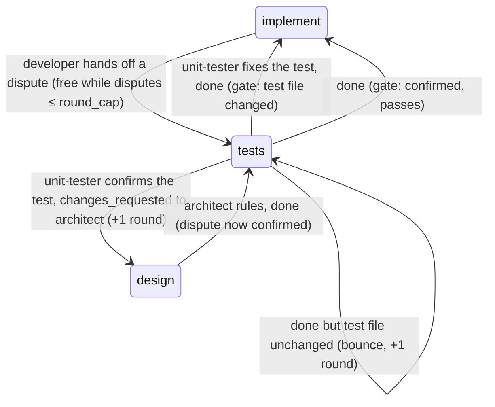

# s11: Test disputes, and rulings at any step

Developer: **developer-cli** (runner Python: `roles.py`, `gates.py`,
`state.py`, `dispatch.py`, `events.py`, `insights.py`, `handover.py`, the
dashboard's `index.html` (one `TIMELINE` row), and the built-in role files
`developer.md`, `unit-tester.md`, `architect.md`, `manager.md` and
`product-owner.md`). In this design step the Architect has already updated
`reference/protocol.md`, `SKILL.md`, the README row,
`docs/customer/routing.md` and the index in `architecture.md`.

Story: `.team/stories/s11.md`.

**Depends on s19.** This design builds on s19's code: `StoryState`'s s19
fields, `handover.HANDOVERS` and `report_fields`, and `state._story`'s nested
`previous`. Run s11's `implement` only after s19 has passed its `implement`
gate. s11's `tests` step can run first, against s19's tests.

## The route



The guard against dodging the round cap (the Manager's concern) has two
parts:

- A dispute is free only when it turns out to be right. If the unit-tester
  confirms the test, its bounce to the architect counts the round the
  developer would have spent on a red gate.
- Free disputes are capped. The first `round_cap` disputes on a story
  cost no round; each later one counts a round, like any bounce. A Manager
  ruling resets the count. So the route always ends, either at a fixed test
  or at the round cap.

## Rules

| # | Rule | AC |
|---|---|---|
| T1 | **Dispute handoff.** A handoff may carry `"dispute": {"test": str, "rule": str, "reason": str}`. `test` is the test id as the test runner prints it, starting with the test file's repo-relative path (`path::name` for pytest). `rule` is the design rule id (e.g. `W6`). `reason` is optional and defaults to the handoff's `summary`. | AC1 |
| T2 | **Malformed dispute.** Two new `HANDOFF_RULES` rows make it a bad handoff: (a) `dispute` is present but is not an object whose `test` and `rule` are non-empty strings (and whose `reason`, if present, is a string): `handoff dispute needs a test id and a design rule`; (b) `dispute` is present and `status` is not `changes_requested`: `handoff dispute needs status changes_requested`. A bad handoff at `implement` bounces to `implement` and counts a round, as today. | AC1 |
| T3 | **Raising.** `Pipeline.evaluate` checks for a dispute right after the `STOPPED_HANDOFFS` check. A handoff with a dispute, on a story at `implement`, with `tests` enabled, gives `Outcome(Verdict.DISPUTE, "{test} contradicts {rule}: {reason}", "tests", OpenDispute(test, rule, reason, base=checks.head()))`. The implement gate does not run. Anywhere else (another step, or `tests` disabled), the `dispute` field is ignored and the step is gated as today. Only developer roles can run at `implement`, so no role check is needed. | AC1 |
| T4 | **The move.** `advance` on `DISPUTE` calls `_dispute(story, outcome)`. It sets `story.dispute = outcome.dispute`, adds 1 to `story.disputes`, and moves the story to `tests`. While `story.disputes <= cap`, no round is counted. Above that, it moves with `_bounce(story, "tests")`, which counts a round and can cap the story. | AC2 |
| T5 | **Event.** `_advance_and_log` emits `EventKind.TEST_DISPUTE` (`"test-dispute"`) instead of `gate` for a `DISPUTE` outcome (table `GATE_EVENTS = {Verdict.DISPUTE: EventKind.TEST_DISPUTE}`, default `GATE`). The data and the report's `gate` dict are the usual gate fields (`step`, `verdict: "dispute"`, `reason`, `now_at: "tests"`, `story_status`, `rounds`) plus `test`, `rule` and `disputes`. | AC2 |
| T6 | **Tests gate while a dispute is open.** At `tests`, with `story.dispute` set and a `done` handoff, the gate is `checks.dispute_settled(story.dispute)` instead of `tests_red`. It passes when `dispute.stage` is `confirmed` (reason `dispute confirmed`), or when the test file has changed since `dispute.base` (reason `disputed test changed`). Otherwise it bounces to `tests` (round counted) with `the disputed test file {file} has not changed; fix {test}, or confirm it with changes_requested and next_role architect`. A `changes_requested` handoff at `tests` goes through `_handoff_outcome` as today. | AC3 |
| T7 | **Confirming.** A bounce that moves a story with an open dispute **from** `tests` to any other step sets `dispute.stage = confirmed` (in `_bounce`, before the step changes). With `next_role: architect` the story goes to `design` and counts a round. | AC3 |
| T8 | **Closing.** Whenever `advance` leaves a story at `implement`, `story.dispute` becomes `None`. `apply_ruling` also sets `dispute = None` and `disputes = 0`, besides `rounds = 0`. | AC2, AC4 |
| T9 | **Brief.** While `story.dispute` is set, `Runtime.user_prompt` adds, after the `Story …` line: `Test dispute ({stage}): {test} contradicts {rule}: {reason}`. This reaches every step on the story, whether the router or the PO briefs it (the unit-tester at `tests`, the architect at `design`). s19's `standard_brief` does not change. | AC3 |
| T10 | **Rulings at any step.** A Manager handoff with a `ruling` on a story is applied whatever the story's status, except when it cannot apply. `gates.ruling_refusal(story)` gives the reason: no story → `a ruling needs a story; run the manager on that story`; a done story → `story {id} is done; a ruling cannot move it`. `apply_ruling` itself is unchanged apart from T8. | AC4 |
| T11 | **Ruling report.** `Runtime.apply_manager` returns, and `_effects` merges into the report, `{"ruling": {"ruling": r, "applied": true, "now_at": step}}`, or `{"ruling": {"ruling": r, "applied": false, "why": reason}}` when T10 refuses. With no `ruling` in the handoff it returns `{}`. The `ruling` event is emitted only when the ruling applies, and its data is unchanged (`{ruling, now_at}`). | AC4 |
| T12 | **Hand-over.** A new last row in `handover.HANDOVERS`: trigger `ruling_not_applied`, `applies`: `(report.get("ruling") or {}).get("applied") is False`, line `{story}: the manager's {ruling} ruling was not applied: {ruling_why}`. `report_fields` gains `ruling` and `ruling_why` (from `report["ruling"]`, `""` when absent). This matters when the router runs the Manager story-less and it rules anyway. | AC4 |
| T13 | **Manager context.** `_manager_context` adds `"test_disputes_since_last_review"`: `insights.disputes_since_review(events)`, one `{"story", "role", "test", "rule", "rounds"}` per `test-dispute` event after the Manager's last step. | AC2 |

## Changes by module

Every function stays at 8 lines or fewer, with at most 2 parameters and no
boolean flags.

| Module | Change |
|---|---|
| `roles.py` | `@dataclass(frozen=True) Dispute`: `test: str`, `rule: str`, `reason: str = ""`. `Handoff.dispute: Dispute \| None = None`, the last field. The two T2 rows in `HANDOFF_RULES`. `_handoff_from` builds the `Dispute` (reason falls back to `summary`). `handoff_report` does not change, so the `step-end` shape stays as the fixture pins it. |
| `gates.py` | `Verdict.DISPUTE = "dispute"`. `class DisputeStage(StrEnum)`: `RAISED = "raised"`, `CONFIRMED = "confirmed"`. `@dataclass OpenDispute`: `test`, `rule`, `reason`, `base: str`, `stage: DisputeStage = RAISED`; `__post_init__` coerces `stage` to the enum (for loading); property `file` = `test.split("::")[0]`. `StoryState` gains, after s19's fields: `dispute: OpenDispute \| None = None`, `disputes: int = 0`. `Outcome` gains `dispute: OpenDispute \| None = None`. `Checks.head()` runs `HEAD_COMMAND = "git rev-parse HEAD"` through `run` and returns stdout stripped. `Checks.dispute_settled(dispute)` (T6) changes when `run(DIFF_COMMAND.format(base=…, path=shlex.quote(file)))` exits **1**, with `DIFF_COMMAND = "git diff --quiet {base} HEAD -- {path}"`. Any other exit code counts as unchanged. `Pipeline`: `_raises_dispute(story, handoff)`, `_raise(handoff)`, `_dispute_gate(story, handoff)`, `_dispute(story, outcome)` (T3, T4, T6). `_bounce` sets T7. `advance` adds the `DISPUTE` move and T8's close. Module function `ruling_refusal(story)` (T10). |
| `state.py` | `_story` turns a `dispute` dict into `OpenDispute(**d)`, the same way s19 turns `previous` into `PreviousStep`. Suggested: one table `NESTED = {"previous": PreviousStep, "dispute": OpenDispute}`. |
| `events.py` | `EventKind.TEST_DISPUTE = "test-dispute"`. |
| `insights.py` | `disputes_since_review(events)` (T13), reusing `_after_last_manager`. |
| `dispatch.py` | `GATE_EVENTS` and `_advance_and_log` (T5). `user_prompt` adds T9's line, through a helper `_story_lines(story) -> list[str]`, so that `user_prompt` stays short. `apply_manager` returns the T11 dict, and a helper `_rule(plan, ruling) -> dict` checks `ruling_refusal`, applies the ruling and emits the event. `_effects` returns `self.apply_manager(plan, handoff)` for the Manager. `_manager_context` adds T13's key. |
| `handover.py` | `Trigger.RULING_NOT_APPLIED`, the T12 row and the two `report_fields` keys. |
| `dashboard/index.html` | `TIMELINE["test-dispute"]`: `{from: e.role, to: "unit-tester", what: "test dispute: implement → tests", tone: "warning", body: e.data.reason, meta: `dispute ${e.data.disputes}, round ${e.data.rounds}`}`. The snapshot fixture does not change, as with s19's `handover` event. |

### Role files (built-in)

- `developer.md`: in "Forbidden", replace "ask through `open_questions` if
  a test is wrong" with "if a test contradicts the design, hand off a test
  dispute". Add a section:

  ```markdown
  ## A test that contradicts the design

  If a test expects something the design rules out, do not work around it.
  Hand off `changes_requested` with a `dispute`, and the runner sends the
  story back to the unit-tester:
  `"dispute": {"test": "<test id as the runner prints it, file path first>",
  "rule": "<design rule id>", "reason": "<what the rule says and what the
  test expects>"}`.
  A dispute the unit-tester upholds costs no round. One it confirms costs a
  round, and only the first round_cap disputes on a story are free. Use it
  only when the test and the design disagree, not when your code fails a
  correct test.
  ```

- `unit-tester.md`: add a section. When the brief has `Test dispute
  (raised)`, compare the test with the design rule. If the test is wrong, fix
  it (and any other test with the same mistake) and hand off `done`; the
  runner checks that the test file changed. If the test is right, hand off
  `changes_requested` with `next_role: architect` and say why. When it says
  `(confirmed)`, the architect has ruled: follow the design, fix the test if
  the architect says so, and hand off `done`.
- `architect.md`: add to "Design review step" or a new short section. When
  the brief has `Test dispute (confirmed)`, rule on it. Either the rule
  stands (say in your summary that the test must change), or the rule
  changes (update the design). Hand off `done` either way.
- `manager.md`: "Round cap" becomes "Rulings". A ruling applies to the story
  your step runs on, at any step, and resets its rounds. It cannot move a
  done story, and it needs a story. Under "What to look for", add:
  `test_disputes_since_last_review`. Many disputes from one role, or on one
  story, point to sloppy tests or to a developer avoiding rounds.
- `product-owner.md` (s19's item 4): add `**ruling not applied**: run the
  manager on the story it meant, or drop it.` After the round-cap bullet,
  add `A ruling works at any step, so you may run_role the manager on a
  stuck story before the cap.`

## Test plan (for the Unit Tester)

**Stale s13 test, fix it at this tests step:**
`test_dispatch.py::test_manual_acceptance_script_reaches_outbox` asserts
the Proxy's tools are `["Write"]`. s13's rule E9 added `Read` to the
`manual` kind (`sandbox.DELIVERY_KINDS["manual"].tools == ("Read",
"Write")`), so the right expectation is `["Read", "Write"]`. This is a
contract correction, not a weakened test.

Contract changes (not weakened tests): the Manager's report now carries
`ruling` whenever its handoff has one. `test_manager_rules_on_capped_story`
keeps its assertions.

1. **T1/T2** (`test_roles.py`): a full dispute parses into `Dispute`. A
   missing `reason` falls back to `summary`. Each malformed case is a
   `HandoffError` with the exact text: no `test`, an empty `rule`, `dispute`
   not an object, a non-string `reason`, and `status: done` with a dispute.
2. **T3/T4** (`test_gates.py`): a dispute at `implement` gives `DISPUTE`
   toward `tests`, with `base` from a stub `run`, and the test command never
   runs. Free disputes: with `cap = 3`, disputes 1–3 leave `rounds` at 0 and
   the 4th counts 1. At the cap, the story is `needs_manager`. A dispute at
   `review`, or at `implement` with `tests` disabled, is gated as today.
3. **T6/T7/T8** (`test_gates.py`): at `tests` with an open dispute and
   `done`, a stub diff exit of 1 passes to `implement` and clears the
   dispute. Exit 0 bounces to `tests` with the exact reason and a round.
   Exit 128 also bounces. `changes_requested` with `next_role: architect` goes
   to `design`, sets `confirmed` and counts a round. A `done` at `tests` with
   `confirmed` passes without running the diff. A tester bounce to
   `implement` clears the dispute. `tests_red` is not called while a dispute
   is open.
4. **T5** (`test_dispatch.py`): a developer step with a dispute emits
   exactly one `test-dispute` event and no `gate` event, with the data shape
   above. The report's `gate.verdict` is `dispute`, and the story is at
   `tests` with `rounds` unchanged.
5. **T9**: the unit-tester's prompt holds `Test dispute (raised): …`. After
   confirmation, the architect's prompt holds `Test dispute (confirmed): …`.
   Once the story is back at `implement`, no prompt holds the line.
6. **End to end through the router** (`test_router.py`, s19's fakes):
   implement (dispute) → tests (tester fixes, stub diff 1) → implement
   (green) runs with no hand-over to the PO and `rounds == 0`.
7. **T10/T11** (`test_dispatch.py`): `revise_design` on an `active` story at
   `review` moves it to `design`, with `rounds = 0`, `disputes = 0` and
   `dispute = None`, emits `ruling`, and reports `applied: true`. Every
   ruling on a `needs_manager` story behaves as before. A ruling on a
   `blocked` story applies. On a done story the report has `applied: false`
   with the exact `why`, the story is unchanged, and there is no `ruling`
   event. A story-less Manager step with a ruling gives the no-story `why`.
8. **T12** (`test_handover.py`): the new row's trigger and line, as one
   more parametrized case. Its line uses `ruling` and `ruling_why`.
9. **T13**: `disputes_since_review` returns only events after the last
   Manager step-end. The Manager prompt holds the key.
10. **State**: a story with an open dispute round-trips through
    `state.json` with its `stage` as a `DisputeStage`. Older files load with
    `dispute = None` and `disputes = 0`.
11. Coverage ≥ 95% (target 100%), `ruff check` and `ruff format --check`
    clean.

## Out of scope

- Checking that the disputed test exists or fails. A wrong test id cannot
  be "fixed" by an unchanged file, so the unit-tester confirms it, and that
  costs a round.
- Disputes raised from steps other than `implement` (for example a reviewer
  who doubts a test). Those go through `changes_requested` as today.
- Dashboard badges for disputes, beyond the timeline row.
