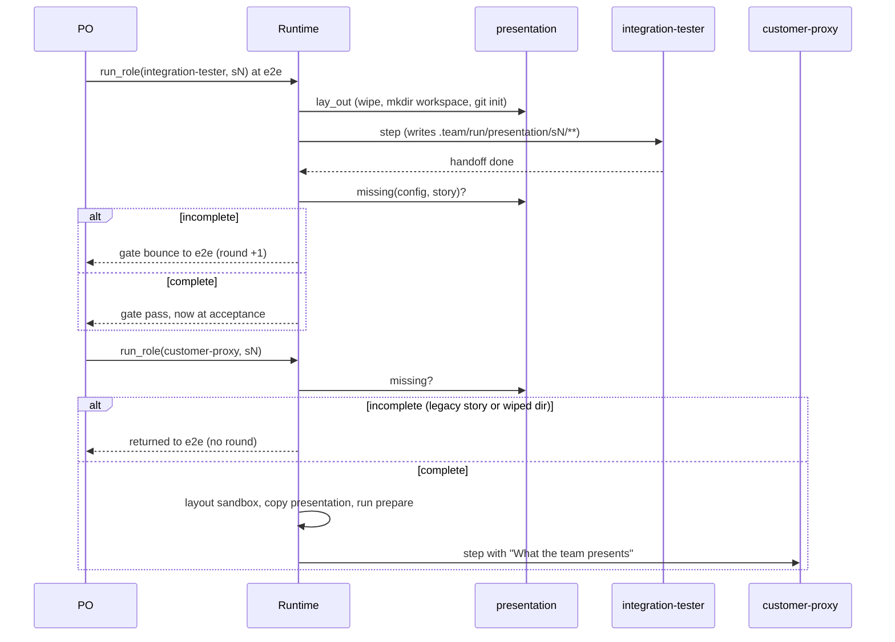

# s13: The team presents the product to the Customer Proxy

Developer: **developer-cli** (runner Python: new `presentation.py`,
`gates.py`, `dispatch.py`, `sandbox.py`, `cli.py`, `git_ops.py`; the built-in
roles `integration-tester.md`, `customer-proxy.md` and `product-owner.md`;
one table row in `dashboard/index.html`). Then **devops** for one
`[[delivery]]` line in `.agile-team.toml` (see "This repo's recipes"). The
Architect updated `reference/protocol.md`, `SKILL.md`, the README row and
`customer/acceptance-presentations.md` in the design step.

Story: `.team/stories/s13.md`. Status: implemented (code baa5330, devops
42f2c1d), design-reviewed. See "Design review" at the end.

The human's rule: the Integration Tester presents the product, and the Proxy
never builds or repairs an environment. The runner enforces it in three
places: the e2e gate, the start of every Proxy step, and the copy into the
Proxy's sandbox.

## Rules

| # | Rule | AC |
|---|---|---|
| E1 | A story's **presentation** lives in `.team/run/presentation/<story>/` (gitignored run files, never committed). It holds `PRESENTATION.md` (what to try for each AC), `workspace/` (the customer's ready-made project) and anything else the tester adds (e.g. `live-status.json`). | AC1 |
| E2 | Before every story-bound `integration-tester` step, the runner lays out a fresh presentation dir: it wipes `.team/run/presentation/<story>/`, and for kinds that need a workspace (table below) it creates `workspace/` and runs `git init -q` in it. Roles can't run `git init` (the hook allows only read-only git), so the runner does it. The story id must match `sandbox.SAFE_NAME`, because the dir is wiped; otherwise the step is refused (`SandboxError`, as for delivery names). | AC1 |
| E3 | `integration-tester` may write `.team/run/presentation/**` (built-in role frontmatter). | AC3 |
| E4 | **e2e gate.** When the pipeline has an `acceptance` step, an integration-tester handoff of `done` at `e2e` passes only if the presentation is complete (E5). Otherwise the gate bounces the story to `e2e` (a round, like the command gates) with the E5 reason. `changes_requested`, `blocked` and `failed` behave as today. | AC3 |
| E5 | **Complete** = `PRESENTATION.md` exists and is not blank after `strip()`, and, when the story's delivery kind needs a workspace, `workspace/` holds at least one entry besides `.git`. A story with no delivery (none configured) needs only `PRESENTATION.md`. `presentation.missing(config, story)` is the single definition; the gate (E4) and the Proxy check (E6) both call it. | AC3 |
| E6 | **Proxy precondition.** When the pipeline has an `e2e` step, `run_role(customer-proxy, sN)` on a story whose presentation is not complete does not start the Proxy. After the refusal checks pass (it is a state change, not a refusal), the runner returns the story to `e2e` **without counting a round** (`Verdict.RETURN`), emits a `gate` event and saves. The PO gets `{"status": "returned", "role": "customer-proxy", "reason": …, "gate": {…}}`. No sandbox is prepared and nothing is billed. | AC2, AC3 |
| E7 | **Copy.** For a Proxy step, the runner copies `.team/run/presentation/<story>/` to `<sandbox>/presentation/` after the sandbox is wiped and **before** the delivery's prepare command runs. A `web` server started by prepare can therefore serve the copy (`{sandbox}/presentation/workspace`). Use `shutil.copytree(…, symlinks=True)`: a symlink the tester left pointing into the repo stays a link, and the Proxy's read rules still block what it points to. With no `e2e` step and no presentation dir, nothing is copied (today's behaviour). | AC3 |
| E8 | The Proxy's prompt gets a section `## What the team presents`. It gives the absolute path of `<sandbox>/presentation/`, says that the customer's workspace is `workspace/` in it, and says that a missing or broken presentation is `changes_requested` to `integration-tester`. Then it quotes `PRESENTATION.md` in full, so every kind has the guide even before it reads a file (a `web` Proxy works mainly through the browser). | AC1, AC2 |
| E9 | **Proxy reads.** The Proxy's Read/Grep/Glob globs add `.team/acceptance/**`, and the OS sandbox `allowRead` adds `<repo>/.team/acceptance`. `Read` is added to the `web`, `harness` and `manual` kinds' tools. Claude Code's Write refuses to overwrite a file the session has not Read, so this is what lets the Proxy rewrite its report in a later step. Source and tests stay denied, and s7's rules are unchanged. | AC5 |
| E10 | **Live run output.** For an AC that only a live run shows (sprints, stops, spend), the tester captures the real output into the presentation, e.g. `agile-team status` of the live run as `live-status.json`, and PRESENTATION.md says what it is. This is a role rule. The gate doesn't check it, because only the ACs say when it applies. | AC4 |
| E11 | `agile-team init` (not `--detect`) in a directory that is not inside a git work tree, or that does not exist, prints `agile-team init: not a git repository: <repo>; run git init first` on stderr and exits 1. It never prints a traceback. | AC6 |

## Presentation recipe per delivery kind (`presentation.PRESENTATIONS`)

A data table keyed by `Delivery.kind`. The runner reads the **Workspace**
column (E2, E5). The other columns are the generic recipe that the
integration-tester role states.

| Kind | Workspace | The tester puts in it | The Proxy uses it as |
|---|---|---|---|
| `package` | `Need.WORKSPACE` | A project set up the way a customer has it after following the install docs, with the state the ACs need | cwd stays the sandbox (the installed product is on PATH); work in `presentation/workspace` |
| `script` | `Need.WORKSPACE` | Sample inputs the scripts run on | same as `package` |
| `web` | `Need.WORKSPACE` | The data the server shows (the delivery's prepare serves `{sandbox}/presentation/workspace`) | browser at the delivery's URL; PRESENTATION.md arrives in the prompt |
| `library` | `Need.WORKSPACE` | A sample consumer project that uses the library | reference next to the empty `consumer/` project, which stays the cwd |
| `harness` | `Need.WORKSPACE` | Inputs for the listed commands | through the listed commands |
| `manual` | `Need.GUIDE_ONLY` | nothing; PRESENTATION.md is the human's starting point | quoted in the prompt; the script for the human builds on it |

`Need` is a `StrEnum` (`workspace`, `guide-only`). An unknown kind is not a
case here: `sandbox.kind_of` already rejects it.

## This repo's recipes (story `delivery` names)

These are the instructions the integration-tester follows here (the PO's
brief points at this table). `$AT` = `uv run --directory agile-team/runner
agile-team`, and `$P` = the **absolute** path
`<repo>/.team/run/presentation/<story>`. The path must be absolute because
`uv run --directory` changes the cwd.

| Delivery | Workspace recipe | Check before handing off |
|---|---|---|
| `cli` (`package`) | `$AT --repo $P/workspace init --preset python --delivery package`. Then write the run files the ACs need into `$P/workspace/.team/run/` (e.g. `state.json` with stories in sprints or a `blocked` status and `status_reason`, an `outbox.jsonl` note, a `crash.log` entry). For live-run ACs: `$AT status > $P/live-status.json`. | `$AT --repo $P/workspace status` prints the state you meant to show. |
| `dashboard` (`web`) | Same `init`, plus sample `state.json`, `events.jsonl`, `ledger.jsonl`, `outbox.jsonl` and `inbox.jsonl` in `$P/workspace/.team/run/`, chosen so that every AC's feature shows (tabs, sprints, a bounce, a question, spend). | `$AT --repo $P/workspace dashboard --no-open --port 0` prints a URL, and `curl <url>api/snapshot` returns the data; stop the server afterwards. |

DevOps change (owned `[[delivery]]` section): the `dashboard` delivery's
`prepare` is

```toml
prepare = "uv run --directory {repo}/agile-team/runner agile-team --repo {sandbox}/presentation/workspace dashboard --host 127.0.0.1 --port 8799 --no-open"
```

so that the Proxy sees the presented run, not the team's live one. The
`cli` delivery doesn't change.

## Flow



## Changes by module

### `presentation.py` (new)

Module docstring: "The team's presentation of a story to the Customer Proxy:
where it lives, what it must hold, and the copy into the Proxy's sandbox."

| Name | Spec |
|---|---|
| `PRESENTATION_DIR = "presentation"`, `GUIDE = "PRESENTATION.md"`, `WORKSPACE = "workspace"` | Names used under the run dir and the sandbox. |
| `Need`, `PRESENTATIONS: dict[str, Need]` | The table above. |
| `source_dir(config, story_id) -> Path` | `config.run_dir / PRESENTATION_DIR / story_id`. |
| `need_of(config, story) -> Need` | `PRESENTATIONS[delivery.kind]` for `config.delivery(story.delivery)`, or `Need.GUIDE_ONLY` when that is `None`. |
| `lay_out(config, story) -> Path` | E2. Refuses an unsafe id with `SandboxError(f"story id {id!r} must match {SAFE_NAME.pattern}")` **before** wiping. Then `sandbox.fresh_dir(source_dir(...))`, and for `Need.WORKSPACE`, `(dir / WORKSPACE).mkdir()` plus `Git(ws).run("init", "-q")`. Pitfall: the workspace is inside the team's repo, so without its own `.git` every git command (including `agile-team init`'s commit) would climb to the team's repo. |
| `missing(config, story) -> str \| None` | E5. Reasons, exact (tests may assert them): `story s4 has no presentation: .team/run/presentation/s4/PRESENTATION.md is missing or empty` and `story s4 has no presentation: .team/run/presentation/s4/workspace is missing or empty` (paths relative to the repo, guide checked first). |
| `copy_into(source, root) -> Path` | E7. `shutil.copytree(source, root / PRESENTATION_DIR, symlinks=True)`; returns the destination. |
| `prompt_section(copied: Path \| None) -> str` | E8. `""` for `None`. Otherwise the heading, the path line, the rule line and the guide's text. |

### `gates.py`

- `Verdict.RETURN = "return"`: docstring "moves back without counting a
  round (the team, not the product, missed a step)".
- `Checks` gains a last field `presentation: Callable[[StoryState], str | None]`
  defaulting to a function that returns `None`, so existing `Checks(...)`
  calls keep working. Method `presented(story) -> Outcome`: `PASS` with
  `"presentation ready"`, or `BOUNCE` with the `missing` reason.
- `Pipeline.evaluate(story, handoff)` replaces `evaluate(step, handoff)`. The
  step is `story.step`. On a `done` handoff, `_done_gate(story, handoff)`
  picks the step's done-gate if there is one, run through `_retry_here`, so
  a failed check stays at `e2e`. The done-gate table is
  `{"e2e": self.checks.presented}`. It applies only when
  `"acceptance" in self.steps` (E4).
- `Pipeline.unpresented(story) -> Outcome | None`: when `"e2e" in self.steps`
  and `checks.presentation(story)` gives a reason, returns
  `Outcome(Verdict.RETURN, f"{reason}; run the integration-tester on it", "e2e")`.
  Otherwise `None`.
- `advance` handles `RETURN` through its verdict → method table:
  `_return(story, target)` sets `story.step` only. Rounds and status don't
  change, and it never escalates at the cap.

### `dispatch.py`

- `INTEGRATION_TESTER = "integration-tester"`. `plan` picks per-role setup
  from a table, `{PROXY: self._attach_delivery, INTEGRATION_TESTER:
  self._lay_out_presentation}`. `_lay_out_presentation` calls
  `presentation.lay_out(self.config, plan.story)`.
- `run_role`: after `refusal` and `settle_po`, and before `plan`,
  `_unpresented(request)` checks a Proxy request with
  `pipeline.unpresented(story)`. On an outcome it advances the story, emits
  the `gate` event (same shape as `gate()`, `verdict: "return"`), saves, and
  returns the E6 report. `gate()` and `_unpresented` share
  `_advance_and_log(plan, outcome)` (advance + emit + result dict). The event
  needs a `Plan` for attribution; build it with
  `Plan(role, self.scope_for(role), story)`, which prepares no sandbox.
- `_attach_delivery`: pass `sandbox.Order(delivery, source)` to
  `prepare_fn`. `source` is `presentation.source_dir(...)` when that dir
  exists, else `None`. `_fit_role_to_delivery` appends
  `presentation.prompt_section(prepared.presentation)` after the guidance.
- `gate()` calls `self.pipeline.evaluate(story, handoff)`.

### `sandbox.py`

- `Order(delivery: Delivery, presentation: Path | None = None)`, frozen
  dataclass. `Preparer.prepare(config, order)` runs `layout`, then
  `_copy_presentation` (which calls `copy_into` when `order.presentation` is
  set and stores the result on the last field
  `Prepared.presentation: Path | None = None`), then `_launch`. The order of
  these three calls is the point of E7.
- `ACCEPTANCE_DIR = ".team/acceptance"`. `proxy_read_globs` adds
  `f"{ACCEPTANCE_DIR}/**"` and `_allowed_reads` adds `repo / ACCEPTANCE_DIR`
  (E9).
- `DELIVERY_KINDS`: `web` and `harness` tools become `("Bash", "Read",
  "Write")`, and `manual` becomes `("Read", "Write")`.

### `cli.py` and `git_ops.py`

- `Git.is_repo() -> bool`: `self.repo.is_dir()` and `git rev-parse
  --git-dir` exits 0 (use `_exec`, not `run`).
- `_require_init_inputs` checks it **first** and raises
  `CliError(f"not a git repository: {repo}; run git init first")` (E11).
  `main` already prints `agile-team init: …` and returns 1.
- `make_pipeline` passes `functools.partial(presentation.missing, config)`
  as `Checks.presentation`.

### Built-in roles (`runner/agile_team/roles/`)

- `integration-tester.md`: `write: ["{e2e}", ".team/run/presentation/**"]`.
  Mission adds: "present the product to the Customer Proxy". Deliverables
  add the presentation: the runner has created
  `.team/run/presentation/<story>/` with an empty git `workspace/`. Build the
  workspace the way the team would hand the product to a customer (follow
  the design's recipe for the story's delivery). Write `PRESENTATION.md`:
  for each AC, what to run or open and what the customer should see. Capture
  live-run output for ACs that need it (E10). Check that it works before you
  hand off. The e2e gate refuses a missing presentation.
- `customer-proxy.md` Rules add: "You are presented the product; you never
  build, install, initialise or repair an environment. If what you were
  presented is missing or broken, stop and return `changes_requested` with
  `next_role: integration-tester`, saying what is wrong. Don't work around
  it." Deliverables add: "If your report already exists from an earlier step,
  Read it, then rewrite it."
- `product-owner.md`: one bullet. "`run_role(customer-proxy)` can return
  `status: returned`: the story had no presentation and is back at `e2e`
  with no round counted. Run the integration-tester on it, and say in the
  brief whether only the presentation is missing."

### `dashboard/index.html`

`STATUS_TONE` gains `return: "warning"`. The board line shows "back to"
for `return` as well as `bounce`. Nothing else changes; the snapshot shape
is the same.

## s4, s5 and s8 (already at `acceptance`)

No state edits and no special code. E6 handles them once s13's code is
running. A running runner keeps its old code, so do `stop`, then
`start --resume`, after s13 is merged:

1. The PO runs `customer-proxy` on s4. There is no presentation, so the
   runner returns s4 to `e2e` with **no round** (s5 keeps its 2 of 3) and
   reports `returned`. Nothing is billed.
2. The PO runs `integration-tester` on s4. The brief says the e2e tests
   already pass at the story's commit, and to build the `dashboard`
   presentation from the recipe. The runner lays out the dir, and the gate
   checks the presentation.
3. s4 is at `acceptance` again, and the Proxy gets the copy. Repeat for s5
   (`dashboard`) and s8 (`cli`: seed a `blocked` state with a
   `status_reason`, a `blocked` outbox note and a `crash.log` entry, and add
   `live-status.json`). s8's earlier `.team/acceptance/s8.md` can now be
   read and rewritten (E9).

s13 itself: if the runner restarts before s13 reaches `e2e`, s13 is the first
story to go through the new gate.

## Test checklist (for the Unit Tester)

Contract changes, not weakened tests: callers of `Pipeline.evaluate(step,
…)` pass the story. Fake `prepare_fn`s take an `Order` (use
`order.delivery`). Assertions on the exact `DELIVERY_KINDS` tools or the
Proxy read globs gain the new entries.

1. E5: `missing` for each case: no dir; blank guide; guide but no
   workspace; workspace holding only `.git`; complete; `manual` with the
   guide only (complete); no delivery configured (guide only). Exact reason
   strings.
2. E2: `lay_out` wipes an old dir, creates `workspace/.git` for `package`
   and no workspace for `manual`, and refuses `../x` before touching
   anything.
3. E4: e2e `done` with no presentation → bounce to `e2e`, round +1, with the
   reason. Complete → pass to `acceptance`. `changes_requested` still
   bounces to the named role. With no `acceptance` step, `done` passes
   without a presentation.
4. E6: Proxy on an unpresented story at `acceptance` → `returned`, story at
   `e2e`, rounds unchanged, status unchanged, a `gate` event with
   `verdict: "return"`, no `prepare_fn` call and no query. With no `e2e`
   step, the Proxy runs as today. Refusals (backlog, done) still come first.
5. E7: `Preparer.prepare` with an `Order` holding a presentation copies it
   to `<root>/presentation` **before** the runner or popen is called (assert
   inside the fake runner that the copy exists). A symlink stays a symlink.
6. E8: the Proxy prompt holds the section and the guide's text; with no
   presentation, there is no section.
7. E9: `proxy_scope` allows Read of `.team/acceptance/s8.md` and still denies
   `agile-team/runner/agile_team/cli.py`. `os_sandbox_settings` `allowRead`
   holds `<repo>/.team/acceptance`. The `web` kind's tools include `Read`.
   The integration-tester's resolved scope allows Write of
   `.team/run/presentation/s4/PRESENTATION.md`.
8. E11: `main(["--repo", str(tmp_path), "init", "--preset", "python",
   "--delivery", "package"])` with `tmp_path` outside any git repo returns 1,
   and stderr is exactly `agile-team init: not a git repository: <tmp_path>;
   run git init first`. Also a path that does not exist. Pitfall: pytest's
   `tmp_path` is outside this repo, but check that no parent of it is a git
   repo, or set `GIT_CEILING_DIRECTORIES`.

E2E (Integration Tester, for s13 itself, `cli`): present a workspace in
which `agile-team init` has run, then show (in PRESENTATION.md) that `status`
works there. Show the init error from a scratch dir outside git.

## Known limits

- `.team/run/` is gitignored, so the hook (Write/Edit globs) is the only
  guard on the tester's presentation writes. Bash writes there are invisible
  to the audit, as for every run file today.
- The gate checks that the presentation exists, not that it is right. The
  Proxy judges that (E8, `changes_requested` to the tester).
- The workspace needs a git identity for `agile-team init`'s commit. It uses
  the machine's git config, as the team's own commits do.

## Design review

Code baa5330 and devops 42f2c1d match E1-E11. The names above are the
code's (`_done_gate`, `_return`, `_unpresented`, `_advance_and_log`,
`_copy_presentation`, `make_pipeline`). The review (`.team/reviews/s13.md`)
passed with these non-blocking follow-ups for the backlog. None changes the
design:

1. Pin the s7 guarantee E7 relies on: a test that `Read` of
   `presentation/workspace/<link>` pointing at source is denied.
2. `prompt_section` raises `FileNotFoundError` on a stale presentation dir
   with no guide (only possible with no `e2e` step). Treat a missing guide
   as no section.
3. `GitError` from `lay_out` (`git init` failing) is not turned into a
   refusal as `SandboxError` is.
4. `_unpresented`: hoist the repeated `self.resolve(request.role)` into a
   local.
5. `_copy_presentation` breaks the `presentation ↔ sandbox` import cycle with
   a deferred import. Move `copy_into` into `sandbox` or inject it.
6. Fixed here: E8 no longer says the `web` Proxy has no Read access (E9
   gives it `Read`).
