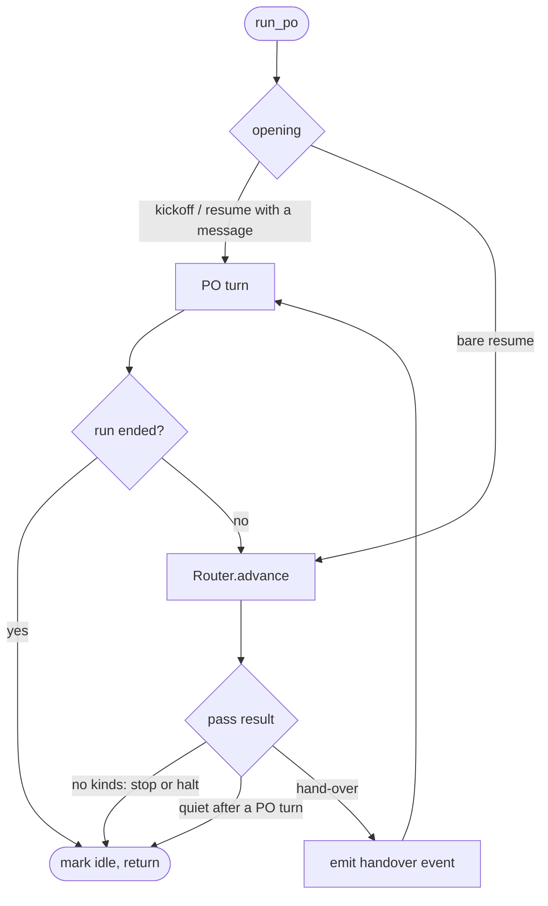
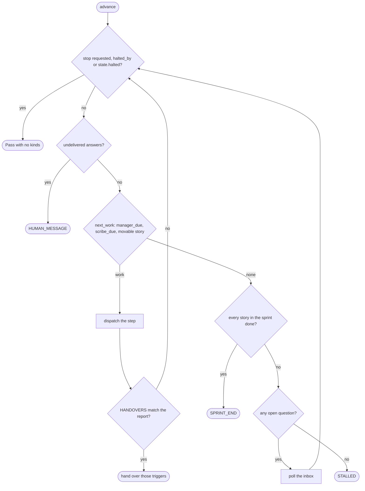

# s19: Routing in code (the runner drives, the PO judges)

Developer: **developer-cli** (runner Python: new `handover.py` and
`router.py`, plus `po_tools.py`, `dispatch.py`, `gates.py`, `state.py`,
`roles.py`, `events.py`, and the built-in `roles/product-owner.md` and
`roles/architect.md`). In this design step the Architect has already updated
`reference/protocol.md`, `SKILL.md`, the README row,
`docs/customer/routing.md` and the index in `architecture.md`.

Story: `.team/stories/s19.md`. Decision record:
[`../adr/ADR-002-routing-in-code.md`](../adr/ADR-002-routing-in-code.md).

## The shape of the change

Today the PO is one long `query()`. Every role step is a `run_role` tool call
that it makes, and each report costs it a turn that re-reads its whole
session. After s19, `po_tools.run_po` becomes a **driver** that alternates
two things:

- **PO turns.** Each turn is a `query()` that resumes the PO's session with a
  prompt: the kickoff, the resume note, or a **hand-over** that lists why the
  PO is needed. The PO handles the hand-over with its tools, then ends its
  turn.
- **Router passes.** `router.Router.advance()` runs steps itself. A pass runs
  the Manager when one is due, the Scribe for a story that has just finished,
  and otherwise the next step of the next movable sprint story. Each step
  gets a **standard brief**. The pass ends at the first hand-over trigger
  (the `HANDOVERS` table), or when the run stops.





Rejected alternative: keep one PO query and have `run_role` loop through the
pipeline inside one tool call. That keeps a single MCP tool call open for
hours, which risks the tool-call timeout. It also cannot hand over between
steps when the human answers. See ADR-002.

## Rules

| # | Rule | AC |
|---|---|---|
| R1 | `run_po(runtime, start)` keeps its signature and is now the driver above. `cli` does not change. | AC1 |
| R2 | A router pass picks work in this order (`Router.PICKERS`, a tuple): (1) the Manager, when `state.manager_due` is not empty; (2) the Scribe, for the first id in `state.scribe_due` whose story is not held and not in `relay.blocked_stories()` (a `manual` acceptance question blocks a done story, and `run_role` would refuse the Scribe on it); (3) the first **movable** story in `state.stories` order. Movable means all of: `story.sprint == state.sprint`, `status is ACTIVE`, `hold is None`, and the id is not in `relay.blocked_stories()`. | AC1, AC5 |
| R3 | The role for a story step is the first non-empty candidate in `ROLE_HINTS` that `role_fits_step(candidate, story.step)` accepts: `story.po_developer`; `previous.next_role` when `previous.verdict` is `bounce`; `previous.role` when `previous.verdict` is `bounce`; `story.developer`; `STEP_ROLES[story.step]`. The last candidate always fits, so a role is always found. | AC3, AC4 |
| R4 | Each step the router starts gets `standard_brief(config, work)` (see "Standard brief"). A story's `note` is added to the brief and cleared once the step has run, unless the step was refused. | AC1, AC3 |
| R5 | After each step the router runs `handover.triggers(report)` over the `HANDOVERS` table. When any row matches, the pass ends and hands over **every** matching row, not just the first. When none match, the pass goes on. | AC2 |
| R6 | **Holds.** `Runtime.note_step(story, report)` sets `story.hold = handover.hold_reason(report)`: the matching trigger names joined by `", "`, or `None` when nothing matches. `Runtime.run_role` calls it for every story step that ran. That covers steps the router started and steps the PO started; it skips `refused` and `halted` reports. The router also calls it for the `refused` and `error` reports of its own steps. A held story is not movable. `continue_story` clears the hold, and so does any later step on the story whose report matches no trigger. | AC2 |
| R7 | The run-level triggers are not in the table. The router raises them: `HUMAN_MESSAGE` when the inbox holds answers that are not in `state.delivered`; `SPRINT_END` when no work is left and every story whose `sprint == state.sprint` is `DONE` (at least one such story must exist); `STALLED` when no work is left, the sprint is not complete and no question is open. | AC2 |
| R8 | When no work is left but a question is open (`relay.open_questions()` is not empty), the router waits. It polls every `POLL_S` (5 s) and re-checks the end conditions on each poll. It stops waiting when an answer comes in that is not in `state.delivered` (giving `HUMAN_MESSAGE`) or when a stop is requested. There is no timeout. | AC2 |
| R9 | **Quiet after a PO turn.** If the PO has just ended a turn and the next pass started no step and returns only `SPRINT_END` and/or `STALLED` (`QUIET_AFTER_PO`), the run ends instead: the PO already knew that state when it ended its turn. This is the only way a run ends other than a stop, a halt or `state.halted()`. | AC2 |
| R10 | The run ends with no further PO turn when a stop is requested, `runtime.halted_by` is set, or `state.halted()` is true. The driver checks this before each pass and after each PO turn. At the end, the status is set to `idle` if it is still `running`, and the state is saved. | AC2 |
| R11 | **Opening.** When `resume_session(runtime, start)` is `None` (kickoff, or a resume with no saved session), the first PO turn gets `first_prompt`, as today. When there is a session and `start.task` is set, it gets `resume_prompt(task)`, as today. When there is a session and no task (a bare resume), a router pass runs first. If that pass hands over, the PO's prompt is `RESUME_NOTE`, a blank line, then the hand-over text. | AC1 |
| R12 | When a gate moves a story to `DONE`, `Runtime._advance_and_log` appends its id to `state.scribe_due`. `note_step` removes the id once a `scribe` step on that story has run, whatever its handoff. The router's Scribe step is story-bound (`story=<id>`). | AC5 |
| R13 | The Manager runs whenever `manager_due` is not empty. That covers sprint start, model overrides and budget checkpoints, as before. The router runs it story-less, with `MANAGER_BRIEF`. `run_role`'s refusal "manager review due: …" is unchanged. | AC5 |
| R14 | **Developer field.** A handoff may carry `"developer": "<role>"`, either a string or `null`. When an `architect` step on a story parses a non-empty `developer`, `story.developer` is set to it. No other role's `developer` is used. `set_developer(story, role)` sets `story.po_developer`, which R3 ranks first. Neither field is checked against the book at the moment it is set. An unknown name surfaces when the step runs, as `run_role`'s `unknown role` refusal, and that is a `REFUSED` hand-over. | AC4 |
| R15 | `story.previous` (a `PreviousStep`) records the last **gated** step on a story, meaning any role not in `UNGATED_ROLES`. It is set from the report by `previous_step(report)`: from a report with a `gate`, or a `bad_handoff` report. A report of any other kind keeps the old value. | AC1, AC3 |
| R16 | `state.delivered` lists the answer ids the PO has already seen. If it is `None` when `run_po` starts (older state, or a fresh run), it is set to every answer id in the inbox, so old answers are never handed over again. A `HUMAN_MESSAGE` hand-over adds the ids it delivers. `wait_for_answers` adds the ids it returns. | AC2 |
| R17 | Before each PO hand-over turn, the driver emits one `handover` event: role `product-owner`, story `None`, data `{"triggers": [...], "stories": [...], "steps": n}`. `steps` counts the steps that pass started. | AC2 |
| R18 | A non-limit exception raised by a step the router started is caught in the router and becomes an `error` report: `{"status": "error", "role": r, "reason": halt.crash_halt(exc).reason}`. `_step_failed` has already written the traceback to `crash.log`. A limit still halts the run, as in s8. `CancelledError` is not an `Exception`, so it is not caught. | AC2 |

## The `HANDOVERS` table (`handover.py`; tests may assert the exact strings)

The rows are in this order. Each row is `Rule(trigger, applies, line)`.
`applies` gets the report dict. `line` is formatted with
`report_fields(report, story_id)`.

| Trigger | `applies(report)` | `line` |
|---|---|---|
| `refused` | `status == "refused"` | `{story}: {role} was refused: {reason}` |
| `error` | `status == "error"` | `{story}: {role} crashed: {reason}; details in .team/run/crash.log` |
| `stopped` | `status in gates.STOPPED_HANDOFFS` | `{story}: {role} reported {status}: {summary}` |
| `bad_handoff` | `status == "bad_handoff" and role in gates.UNGATED_ROLES` | `{story}: {role} gave no valid handoff: {reason}` |
| `questions` | `open_questions` is not empty | `{story}: {role} asks: {questions}` |
| `quarantine` | `quarantine` is truthy | `{story}: {role}'s out-of-scope changes are quarantined in {quarantine}; tell the owning role to reuse them (git cherry-pick -n {quarantine}) or ignore them` |
| `round_cap` | `gate.story_status == "needs_manager"` | `{story}: hit the round cap; run the manager on it for a ruling` |
| `unroutable` | `gate.verdict == "bounce"`, `next_role` is set, and no step in `STEP_ROLES` fits it (`role_fits_step`) | `{story}: {role} sent it back for {next_role}, which owns no pipeline step; brief {next_role} yourself, then continue_story` |

`report_fields(report, story_id)` gives these keys, each `""` when absent:
`story` (`story_id`, or `run` when `None`), `role`, `status`, `summary`,
`reason`, `questions` (`"; ".join(open_questions)`), `quarantine` and
`next_role`. The `gate` dict is read only by the predicates.

The router's reports always carry `role`. It builds `{"role": work.role,
**report}`, because `refused()` reports have no `role`.

How AC2's "a step that needs a brief beyond the standard one" maps to rows:
a quarantine is `quarantine`, and a bounce reason the runner cannot pass on
as is is `unroutable` (there is no pipeline role to pass it to).

What does **not** hand over: `done` with a pass, a gate bounce (failing or
passing tests, coverage, a missing presentation), `changes_requested` to a
role that owns a step, a gated role's `bad_handoff` (it bounces and counts a
round, so the cap catches repeats), and `returned`. The router passes each of
these on in the next standard brief (AC3).

Run-level lines (built by the router, not by the table):

| Trigger | Lines |
|---|---|
| `human_message` | One per new answer: `The human answered {id} ("{question text}"): {answer text}` |
| `sprint_end` | `Sprint {n} is complete: every story in it is done.` |
| `stalled` | `Nothing in sprint {n} can move.`, then one line per unfinished story in the sprint: `{id} at {step}: {why}`. `why` comes from `STALL_REASONS`: held → `held ({hold})`, `needs_manager` → `at the round cap`, `blocked` → `escalated to the human`. When no unfinished story is in the sprint, the lines are `No story is in sprint {n}; start_sprint with the stories to work on.` followed by `Backlog: {ids}` when the backlog is not empty. |

## Hand-over prompt (the PO's turn message)

```text
The runner needs you (sprint {n}; {steps} steps since your last turn):
- {line}
- {line}
Stories: s19 implement r1 held, s20 done, s21 design r0
Handle these, then end your turn; the runner carries on with the pipeline.
continue_story(story, note) releases a held story and passes your note to its
next step. set_developer(story, role) picks its developer. Use run_role only
for a step that needs a brief of your own.
```

`Stories:` lists every story in the current sprint in the form
`{id} {step} r{rounds}`, followed by ` held` when it is held, or by its status
when that is not `active`. A done story shows as `{id} done`. The fixed text
is the module constant `HANDOVER_FOOTER`.

## Standard brief (`router.standard_brief(config, work)`)

The heading is `BRIEF_HEADINGS.get(role, STEP_HEADING)`:

| Role | Heading |
|---|---|
| default (`STEP_HEADING`) | `Standard brief from the runner. Read the files below; they hold the details.` |
| `scribe` | `Story {id} is done. Record its decisions as ADRs and refresh the role briefs. Read the files below.` |
| `manager` | `MANAGER_BRIEF`: `Manager review due: {"; ".join(state.manager_due)}`. No path lines; the runner context follows as today. |

Then one line per row of `BRIEF_PATHS`, for every row that has an existing
file (paths are repo-relative, checked under `config.repo`):

| Label | Candidates, first existing wins |
|---|---|
| `Story` | `.team/stories/{id}.md` |
| `Design` | `{docs}/design/{id}.md`, then `{docs}/architecture.md` |
| `Review` | `.team/reviews/{id}.md` |

`{docs}` is `config.team.docs_dir` without a trailing `/`. Each line is
`- {label}: {path}`.

Then, from `story.previous` and `story.note`:

| Line | When |
|---|---|
| `- Previous step: {role} reported {status}` plus `: {summary}` when there is a summary | `previous` is set |
| `- Sent back to this step: {reason}` | `previous.verdict` is `bounce` or `return` |
| `- From the PO: {note}` | `note` is not empty |

Example (a review bounce, AC3):

```text
Standard brief from the runner. Read the files below; they hold the details.
- Story: .team/stories/s19.md
- Design: agile-team/docs/design/s19.md
- Review: .team/reviews/s19.md
- Previous step: code-reviewer reported changes_requested: two functions exceed 8 lines
- Sent back to this step: two functions exceed 8 lines
```

`Runtime.user_prompt` still adds `Story s19: … (step implement, round 1)`
and any Manager follow-ups, so the brief does not repeat them.

## New and changed PO tools (`po_tools.SCHEMAS`)

| Tool | Schema | Refusals (exact) | Effect and result |
|---|---|---|---|
| `continue_story` | `{"story": str, "note": str}` | unknown id → `unknown story 'sN'; open it with open_story`; done → `story sN is done` | `hold = None`, `note = args.get("note", "")`, save. Result: `{"status": "continued", "story": id, "step": step}` |
| `set_developer` | `{"story": str, "role": str}` | unknown id → as above; role not in `book.names()` → `unknown role 'x'`; `role_fits_step(role, "implement")` is false → `x is not a developer role` | `po_developer = role`, save. Result: `{"status": "set", "story": id, "developer": role}` |
| `wait_for_answers` | unchanged | — | also adds the returned ids to `state.delivered` and saves (R16) |
| `story_status` | unchanged | — | `asdict(s)` replaces `vars(s)`, because `previous` is a dataclass that `json.dumps` cannot serialize |
| `run_role` | unchanged | — | description becomes: `Run one role step yourself with your own brief; the runner runs standard steps on its own. Returns the handoff and gate.` |

Descriptions:

- `continue_story`: `Release a story the runner handed to you; your note is added to its next step's standard brief.`
- `set_developer`: `Choose the developer specialisation for a story's implement steps (overrides the architect's pick).`

Refusals change nothing (guidelines: "Refusals and side effects").

## Changes by module

Every function stays at 8 lines or fewer, with at most 2 parameters besides
`self` and no boolean flags.

### `gates.py`

- New `@dataclass PreviousStep`: `role: str`, `status: str`, `summary: str =
  ""`, `verdict: str = ""`, `reason: str = ""`, `next_role: str | None = None`.
- `StoryState` gains five fields, **after** `sprint`, in this order:
  `developer: str | None = None`, `po_developer: str | None = None`,
  `hold: str | None = None`, `note: str = ""`,
  `previous: PreviousStep | None = None`.

### `roles.py`

- `Handoff.developer: str | None = None`, the last field.
- A new `HANDOFF_RULES` row: `(lambda d: d.get("developer") is None or
  isinstance(d.get("developer"), str), "developer must be a role name")`.
- `_handoff_from` passes `developer=data.get("developer") or None`.
- `handoff_report` (in dispatch) does **not** gain `developer`. That keeps
  the `step-end` event shape the fixture pins.

### `state.py`

- `RunState` gains, last: `scribe_due: list[str] = field(default_factory=list)`
  and `delivered: list[str] | None = None`.
- `_story`: turn a `previous` dict into `PreviousStep(**d)`, keeping `None`
  as `None`. Older files have no `previous` key, so they load as `None`.

### `events.py`

- `EventKind.HANDOVER = "handover"`. The dashboard fixture does not change.
  The UI already ignores kinds it does not know (`TIMELINE[e.kind]?.`,
  `EVENT_EDGE[e.kind]?.`).

### `handover.py` (new)

Module docstring: "When the runner hands control to the PO: the `HANDOVERS`
table over step reports, and the hand-over prompt."

| Name | Spec |
|---|---|
| `class Trigger(StrEnum)` | `REFUSED`, `ERROR`, `STOPPED`, `BAD_HANDOFF`, `QUESTIONS`, `QUARANTINE`, `ROUND_CAP`, `UNROUTABLE`, `HUMAN_MESSAGE`, `SPRINT_END`, `STALLED`, with the values shown in the tables above (snake case). |
| `@dataclass(frozen=True) Rule` | `trigger: Trigger`, `applies: Callable[[dict], bool]`, `line: str`. |
| `HANDOVERS: tuple[Rule, ...]` | The table. |
| `QUIET_AFTER_PO = frozenset({SPRINT_END, STALLED})` | R9. |
| `HANDOVER_FOOTER` | The fixed text of the hand-over prompt. |
| `matching(report) -> list[Rule]` | The rows whose `applies` is true, in table order. |
| `triggers(report) -> list[Trigger]` | `[r.trigger for r in matching(report)]`. |
| `hold_reason(report) -> str \| None` | `", ".join(triggers)` or `None`. |
| `report_lines(report, story_id) -> list[str]` | `[r.line.format(**report_fields(report, story_id)) for r in matching(report)]`. |
| `report_fields(report, story_id) -> dict[str, str]` | As specified above. |
| `previous_step(report) -> PreviousStep \| None` | R15: from a `gate` report, `PreviousStep(role, status, summary, gate.verdict, gate.reason, next_role)`; from `bad_handoff`, `PreviousStep(role, "bad_handoff", "", "bounce", reason)`; otherwise `None`. |
| `@dataclass Pass` | `kinds: list[Trigger]`, `lines: list[str]`, `stories: list[str]`, `steps: int = 0`. `kinds == []` means the run ended. `quiet(self) -> bool` is true when `steps == 0`, `kinds` is not empty and `set(kinds) <= QUIET_AFTER_PO`. `stories` is: the work's story id for a report hand-over (`[]` for story-less work); the union of the answered questions' `stories` for `HUMAN_MESSAGE`; the sprint's unfinished ids for `STALLED`; `[]` for `SPRINT_END`. |
| `board(state) -> str` | The `Stories:` line. |
| `prompt(pass_, state) -> str` | The hand-over prompt: the header (`state.sprint`, `pass_.steps`), `- {line}` for each line, `board(state)` and `HANDOVER_FOOTER`. |

Predicates that read `gate` use `report.get("gate") or {}`.

### `router.py` (new)

Module docstring: "Drives sprint stories through the pipeline between PO
turns: picks the next step, briefs it, runs it, and stops at a hand-over."

| Name | Spec |
|---|---|
| `@dataclass Work` | `role: str`, `story: StoryState \| None`, `brief: str`. |
| `ROLE_HINTS` | A tuple of `Callable[[StoryState], str \| None]` in R3 order. |
| `step_role(story) -> str` | R3. |
| `BRIEF_PATHS`, `BRIEF_HEADINGS`, `STEP_HEADING`, `MANAGER_BRIEF` | The data under "Standard brief". |
| `standard_brief(config, work) -> str` | The brief. Helpers: `_path_lines(config, story_id)` and `_history_lines(story)`. |
| `STALL_REASONS` | The `stalled` table: `hold` → held, `StoryStatus.NEEDS_MANAGER`, `StoryStatus.BLOCKED`. |
| `@dataclass Router` | `runtime: Runtime`, `sleep: Sleep = asyncio.sleep`. |
| `Router.advance() -> Pass` | The loop in the second diagram. It counts `steps`. |
| `Router.PICKERS` | `(_manager_work, _scribe_work, _story_work)`; `next_work()` returns the first non-`None`. |
| `Router._dispatch(work) -> dict` | Calls `runtime.run_role(StepRequest(work.role, work.brief, id))`. Catches `Exception` and returns R18's `error` report. On `refused` and `error`, calls `runtime.note_step`. Clears `story.note` unless refused. Returns `{"role": work.role, **report}`. |
| `Router._ended() -> bool` | R10's three conditions. |
| `Router._news() -> list[Answer]` | Answers not in `state.delivered`, in inbox order. |
| `Router._deliver(answers) -> Pass` | Adds their ids to `delivered`, saves, and returns a `HUMAN_MESSAGE` pass with R7's lines. |
| `Router._idle() -> Pass \| None` | `SPRINT_END`, or `None` when it should wait (R8), or `STALLED`. |
| `Router._wait() -> None` | Sleeps `POLL_S` once. `advance` loops back, so the end checks and `_news` run again. |

The router imports `dispatch` (`Runtime`, `StepRequest`), `gates`, `halt` and
`handover`. It never imports `po_tools`. `po_tools` imports the router.

### `dispatch.py`

- `Runtime.note_step(story, report) -> None` (public): does R6 (hold), R15
  (`previous`, gated roles only) and R12 (remove from `scribe_due` when
  `report["role"] == "scribe"`), then saves.
- `run_role`: once `_run_planned` or `_unpresented` returns a report whose
  status is not `halted`, call `note_step` when the request had a story. The
  refusal paths return before this, so they stay side-effect free.
- `_advance_and_log`: after `advance`, if `story.status is DONE`, append the
  id to `state.scribe_due`.
- `_effects`: when the role is `architect`, the story is set and
  `handoff.developer` is non-empty, set `story.developer`. Suggested: a table
  `STORY_EFFECTS = {ARCHITECT: _capture_developer}` next to the Manager
  branch, rather than another `if`.
- New constants `SCRIBE = "scribe"` and `ARCHITECT = "architect"`.

### `po_tools.py`

- `PoTurn(prompt: str, resume: str | None)`, a frozen dataclass.
  `po_plan(runtime, turn)` takes it instead of `Start`.
- `PoRun` becomes the driver: `run()` → R10/R11 loop; `_turn(prompt)` →
  plan, `_collect`, `_settle`, `_record`. `_record` **no longer** marks the
  run idle; `run()` does that once at the end (R10). The first turn resumes
  `resume_session(runtime, start)`, and every later turn resumes
  `state.po_session`.
- `run()` sets `halted_by = None` and `RUNNING`, applies R16's
  initialisation, and returns the last PO turn's `StepResult`. If there was
  no PO turn, it returns `StepResult("", 0.0)`.
- The `HANDOVER` event (R17) is emitted by the driver just before each
  hand-over turn.
- New `Tools.continue_story` and `Tools.set_developer`, refusal first.
  `wait_for_answers` and `story_status` change as above.
- `run_po(runtime, start)` keeps its signature (R1). Its docstring becomes
  "Drive the run: PO turns for judgement, router passes for the pipeline."

### `roles/product-owner.md` (built-in)

Frontmatter: `model: sonnet` (AC6). Everything else in the frontmatter stays
as it is. `description: Writes the stories, starts sprints and makes the
team's judgement calls; the only role that talks to the human.`

Replace "Mission" and "How you work". Delete step 6 (the Scribe). Keep "Stay
in your lane", "Backlog and sprints", "Returned stories" (reworded below),
"Cadence", "Models and budget" and "Forbidden". New text:

```markdown
## Mission

Turn the human's task into stories, commit them to sprints, and make the
judgement calls the runner hands you. The runner moves every sprint story
through the pipeline itself. It starts each step's role with a standard brief
(story file, design, review file, previous handoff), sends a story back with
the gate's reason, runs the manager when one is due and the scribe after each
story is done. You do not route steps it already routes, and you never do
another role's work.

## How you work

1. Kickoff: interview the human with `ask_user` until the goal, scope, users
   and acceptance criteria are clear. Ask few, sharp questions at a time, then
   `wait_for_answers`.
2. Write stories to `.team/stories/<id>.md` (user story, acceptance criteria,
   delivery it applies to), then `open_story` each one. A new story sits in
   the backlog (`sprint: null`) and cannot move yet.
3. `start_sprint(goal, stories=[...])`, then end your turn. The runner runs
   the manager, then the stories.
4. The runner hands control back to you only for judgement. Your prompt
   lists each reason. Handle every line, then end your turn:
   - **asks**: answer from the story and what the human has said, or
     `ask_user` (it blocks only the stories you list). Pass your answer on
     with `continue_story(story, note)`.
   - **reported blocked/failed** or **crashed**: decide what unblocks it
     (`continue_story` with a note, `set_role_model`, or `ask_user`).
   - **quarantined**: decide whether the owning role should reuse the sha;
     say so in `continue_story(story, note)`, or ignore it.
   - **round cap**: `run_role` the `manager` on that story for a ruling, then
     act on it (`upgrade_model` → `set_role_model`; `escalate` → `ask_user`).
   - **sent back for a role with no pipeline step** (devops, you): run that
     role with `run_role`, then `continue_story`.
   - **refused**: do what the reason says.
   - **the human answered**: act on it, and `continue_story` the stories it
     unblocks.
   - **sprint complete** or **nothing can move**: see Cadence. Fix what the
     list says (`start_sprint`, `continue_story`, `ask_user`), or end your
     turn to stop the run.
5. A story in your prompt is held. The runner skips it until you
   `continue_story` it or `run_role` a step on it yourself.
6. The architect names each story's developer specialisation, and the runner
   uses it. `set_developer(story, role)` overrides it for that story.
7. After `start_sprint` or `set_role_model`, end your turn; the runner runs
   the manager first.
8. On `halted`, the run is stopping. Make no more tool calls and end your
   turn.
9. Keep the human informed with `notify_user` at milestones, not every step.
```

"Returned stories" becomes one line: `A customer-proxy step can come back as
returned: the story had no presentation and the runner sends it back to e2e
by itself.` In "Stay in your lane", drop the bullet "Keep briefs short…".
Instead, add to item 4 above: `In a run_role brief or a continue_story note,
point at artifacts rather than restating them, and never prescribe line-level
code or test edits.`

### `roles/architect.md` (built-in)

In "Deliverables", replace the sentence about naming specialisations in the
summary with:

```markdown
Write each story's design to `<docs>/design/<story>.md` and add a one-line
entry for it in `architecture.md`'s story index. Name the developer
specialisation the story needs (`developer-gui`, `-cli`, `-api`, `-db`, or a
new one) in your handoff's `"developer"` field, e.g.
`"developer": "developer-cli"`. The runner uses it for the implement step.
If a new specialisation is needed, describe it in `open_questions` so the PO
can add it.
```

## Legacy state and self-hosting

- The old `state.json` loads unchanged. New story fields default to `None`
  or `""`. `scribe_due` is `[]`, and `delivered` is `None`, which becomes
  "every answer so far" on the first `run_po` (R16).
- This repo's first `start --resume` after s19 goes like this. The PO role
  is now on Sonnet, and the resumed session (an Opus transcript) carries on
  under it. A bare resume runs the router first. Sprint stories carry on at
  their current step with standard briefs. For s19 itself, the `Design:` line
  points at this file.
- A runner that is already running keeps its loaded code. The change takes
  effect after `stop` and then `start --resume`.

## Test checklist (for the Unit Tester)

Contract changes (these do not weaken tests): any `run_po` test whose fake
query asserts on the resume prompt now sees R11's router-first behaviour.
`story_status` output now carries the new story fields. Tests that ran
`run_po` with a fake PO and no sprint still see exactly one PO turn (R9).

1. **Automatic advance (AC1).** With a story in sprint 1 at `design` and a
   fake query that returns `done` handoffs, one `run_po` runs the architect,
   the unit-tester, a developer and the rest of the pipeline to `DONE`, then
   the scribe, then hands `SPRINT_END` to the PO. Assert the order of
   `step-start` roles and that the PO's query ran exactly twice (kickoff and
   sprint end). Test gates with a stub `Checks.run` (red then green).
2. **Standard brief (AC1, AC3).** `standard_brief` for each path case: no
   design file (falls back to `architecture.md`), a design file, a review
   file present or absent, `previous` with and without a summary,
   `bounce`/`return` giving "Sent back…", `pass` not giving it, the note
   line, and the scribe and Manager headings.
3. **Each hand-over trigger (AC2).** One parametrized test per `HANDOVERS`
   row, through `handover.triggers`. Also a report that matches several rows
   gives all of them in table order, and a clean `done` gives none. Through
   the router: `HUMAN_MESSAGE` (an answer not in `delivered` stops the pass
   before the next step), `SPRINT_END`, `STALLED` (each `STALL_REASONS` row
   plus the no-sprint line), waiting (R8, with a fake `sleep` that writes an
   answer), and the R9 quiet end. Round cap: a third bounce with
   `round_cap = 3` hands over `round_cap`.
4. **Holds (R6).** A step reporting `blocked` holds the story, and the next
   pass skips it. `continue_story` clears the hold and the note reaches the
   next brief, then is cleared. A PO `run_role` whose report is clean clears
   the hold. A refused PO `run_role` leaves state, events and holds
   untouched.
5. **Bounce briefs (AC3).** A reviewer's `changes_requested` with `next_role:
   developer-gui` → the next step runs `developer-gui` with "Sent back to this
   step: <summary>" and the review path. A red implement gate → the same
   developer reruns with the test tail.
6. **Specialisation choice (AC4).** One parametrized test over `ROLE_HINTS`:
   none set → `developer`; architect's `developer` → used;
   `po_developer` beats a bounce `next_role`; a bounce `next_role` beats the
   architect's pick; a retry after a red gate keeps `previous.role`; a
   non-fitting hint is skipped. Also: an `architect` handoff with
   `"developer"` sets `story.developer`, while another role's does not;
   `"developer": 3` is a bad handoff; `set_developer`'s three refusals.
7. **Automatic Scribe and Manager (AC5).** A story reaching `DONE` queues
   `scribe_due`, and the router runs `scribe` on it next with the scribe
   heading. The entry is cleared even on a bad scribe handoff (which hands
   over `bad_handoff`). A done story that an open question blocks is
   skipped by the Scribe picker until the question is answered.
   `manager_due` (after `start_sprint`, a
   `set_role_model` or a crossed budget checkpoint) makes the router run the
   manager story-less before any story step.
8. **Driver ends (R10).** A stop file, a limit halt in a router step (the PO
   gets no further turn, and `_finish` exits 75), and `notify_user`
   `sprint-end` under the sprint cadence each end the run. The status ends
   `idle` only when it was still `running`.
9. **Errors (R18).** A step whose fake query raises `RuntimeError` hands over
   `error` with `crashed: RuntimeError: …` and holds the story.
10. **State (R16, legacy).** `from_json` without the new keys loads the
    defaults; `previous` round-trips. `delivered=None` is initialised to the
    existing answer ids, so old answers are not handed over.
11. **Event (R17).** A hand-over turn is preceded by exactly one `handover`
    event with the data shape above.
12. Coverage ≥ 95% (the target stays 100%); `ruff check` and
    `ruff format --check` clean (AC7).

## Out of scope / known limits

- Running two stories' steps in parallel. The router runs one step at a time,
  finishing the first movable story before it starts the next.
- Dashboard rendering of `handover` events, and a "held" badge on stories
  (backlog). The snapshot's story fields do not change.
- The runner does not post progress notes of its own. The human sees
  progress on the dashboard and through the PO's `notify_user` at hand-overs.
- A story-less Manager step has no hold. A Manager step that keeps failing
  (malformed handoffs, or errors) leaves `manager_due` set, so each pass after
  a PO turn reruns it and hands over `bad_handoff` or `error` again. The PO's
  way out is `set_role_model` or `notify_user` `blocked`.
- While a question is open and nothing else can move, the runner waits
  indefinitely (R8). `agile-team stop` ends the wait.
