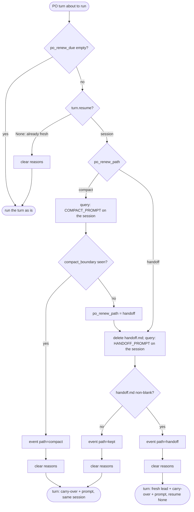

# s23: Keep context small

Developer: **developer-cli**. The story touches runner Python (new
`po_session.py`, plus `po_tools.py`, `dispatch.py`, `state.py`, `ledger.py`,
`insights.py` and `events.py`), the built-in role files, `dashboard/index.html`
and the fixture script. All of it is inside `{source}`.
In this design step the Architect has already updated `reference/protocol.md`,
`SKILL.md`, the README row, `docs/customer/dashboard.md` and the index in
`architecture.md`.

Story: `.team/stories/s23.md` (with the human's m16 answers). Findings, with
numbers, and the decision:
[`../adr/ADR-003-lean-context.md`](../adr/ADR-003-lean-context.md). This
design builds on s19's driver (`po_tools.PoRun`) and router.

## What the measurement found (details in ADR-003)

| Cause (s19 Unit Tester, 3.19M re-sent over 25 calls) | Share | Fix here |
|---|---|---|
| The human's claude.ai connectors loaded into every session (≈43k per call) | 33% | L1 |
| Whole-module `cat`s, a 42.2 KB output cut to a 2 KB preview, then re-read | 35% | L2, L3 |
| Design and story read on call 1 | 11% | L4 (per-story designs already briefed) |
| Writing and patching tests, test runs | 14% | L3 |
| Full test-suite output | small | L2, L3 (rule only) |

## Part 1: renewing the PO's session (AC1)



| # | Rule |
|---|---|
| P1 | **Boundaries.** `RunState.po_renew_due: list[str]` holds the reasons. `Tools._begin_sprint` appends `sprint {n} start`. `Runtime._advance_and_log` appends `{id} done` when the story becomes `DONE`, next to `scribe_due`, and never twice for the same id. |
| P2 | **When.** The driver renews lazily, right before a PO turn: `PoRun._turns` runs `turn = await self._renewed(turn)` before each `self._turn(turn)`. Several boundaries between two PO turns give one renewal. A boundary inside a PO turn (`start_sprint`) is handled before the *next* PO turn. |
| P3 | `_renewed(turn)`: if `po_renew_due` is empty, return `turn` unchanged. If `turn.resume is None` (kickoff, or a resume with no saved session), clear the reasons, save, and return `turn`: it is already fresh. Otherwise call `RENEWERS[RenewPath(state.po_renew_path)]`, then clear the reasons and save. |
| P4 | **Compact path** (`po_renew_path` default `"compact"`). Run one PO query with `PoTurn(COMPACT_PROMPT, turn.resume)` through `PoRun._turn` (so it is planned, settled and ledgered like any PO turn). It worked when its `StepResult.compacted_from` is not `None` (see C1). Then emit P8's event with path `compact`, and return `PoTurn(with_carry_over(relay, turn.prompt), state.po_session)`. |
| P5 | **Compact fallback.** When `compacted_from` is `None`, set `state.po_renew_path = "handoff"`, save, and go on with P6 in the same call. Later boundaries skip the `/compact` attempt. |
| P6 | **Handoff path.** Delete `<repo>/.team/po/handoff.md` if it exists. Then run one PO query with `PoTurn(HANDOFF_PROMPT, turn.resume)` through `_turn`, and read the file. If it is non-blank: emit path `handoff`, and return `PoTurn(fresh, None)`, where `fresh` is P7's prompt. The `_record` of that next turn saves the new session id as soon as its query ends, before any router pass. If the file is missing or blank: emit path `kept`, and return `PoTurn(with_carry_over(relay, turn.prompt), state.po_session)`. The old session goes on, and the next boundary tries again. |
| P7 | **Fresh prompt.** `"\n\n".join` of the non-empty parts, in this order: `first_prompt(runtime, Start(state.task))`; `FRESH_LEAD.format(file=HANDOFF_FILE, handoff=<text>, status=json.dumps(story_status_data(runtime), indent=1))`; `carry_over(relay)`; `turn.prompt` (the kickoff, resume or hand-over prompt the turn was going to send). |
| P8 | **Event.** `EventKind.PO_SESSION = "po-session"`, role `product-owner`, story `None`, data `{"path": "compact" \| "handoff" \| "kept", "reasons": [...po_renew_due], "pre_tokens": int \| None}`. `pre_tokens` is `compacted_from` on the compact path, otherwise `None`. It is emitted before the reasons are cleared. |
| P9 | **Never drop.** Open questions are carried over from the relay, not from the session. `carry_over(relay)` is `""` when `relay.open_questions()` is empty. Otherwise it is `CARRY_HEAD`, then one line per question: `- {id} (blocks {", ".join(stories) or "nothing"}): {text}`. Answers do not depend on the PO's memory: `state.delivered` tracks delivery, and the router hands over every answer not in it (s19 R7/R16). A `HUMAN_MESSAGE` hand-over's text is in `turn.prompt`, which every path keeps verbatim. Renewal never touches `delivered`. |
| P10 | **Errors.** A renewal query that raises behaves like any PO turn: a limit halts the run, and on an SDK `ResultError` `_collect` keeps the session. The reasons are cleared only after a path returns, so a halted run still has `po_renew_due` in `state.json`. The next run renews before its first resumed turn. |
| P11 | **Ledger.** Renewal queries are ordinary PO entries (role `product-owner`, with tokens and turns). |
| P12 | The PO may write `.team/po/**` (role frontmatter), so `settle_po` commits `handoff.md`. |

### Texts (`po_session.py`; tests may assert them)

```python
HANDOFF_FILE = ".team/po/handoff.md"
KEEP = (
    "open decisions; pending questions with their ids and the stories they block; "
    "what is next and why; paths to artifacts (stories, designs, reviews) rather "
    "than their content"
)
COMPACT_PROMPT = f"/compact Keep only what your next turns need: {KEEP}. Drop the step-by-step history."
HANDOFF_PROMPT = (
    "The runner is renewing your session to keep it small. Write "
    f"{HANDOFF_FILE} with: {KEEP}. Write nothing else, then end your turn."
)
FRESH_LEAD = (
    "You are continuing this run in a fresh session. Your previous session's "
    "handoff ({file}):\n\n{handoff}\n\nstory_status:\n{status}"
)
CARRY_HEAD = "Open questions (from the inbox; they stay open until the human answers):"
```

### Which path works (AC1 evidence)

- Static evidence for `compact`: the installed SDK (bundled CLI 2.1.286)
  types `PreCompactHookInput.trigger` as `"manual" | "auto"`, with
  `custom_instructions`. `session_mutations.py` remaps the compact
  boundary's `logicalParentUuid`, and `session_summary.py` skips
  `isCompactSummary` entries. Manual compaction is a slash command sent as
  the prompt.
- Live evidence: C1 detects the boundary on every attempt, and P8 logs the
  outcome. The design expects `compact`. Whatever happens, the fallback is
  automatic and tested. The Scribe records the first live `po-session` path
  in ADR-003.

## Part 2: turns and context per step (AC2, AC3)

| # | Rule |
|---|---|
| T1 | The ledger already records `turns` for every role step and every PO query (`Entry.turns`, from `ResultMessage.num_turns`). Lines written before that have none and load as `0`. Such entries are **unmeasured**: they count as steps, but not in turn averages. |
| T2 | The `step-end` event gains `turns` (int): `_emit_step_end` adds `turns=result.turns`. |
| T3 | `Tokens.prompt() -> int` = `input + cache_read + cache_creation` (the context one step re-sent). |
| T4 | `Totals` gains `measured: int = 0`, `measured_prompt: int = 0` and `latest_turns: int = 0`. `add(entry)`, for an entry with `turns > 0`, adds 1 to `measured`, adds `entry.tokens.prompt()` to `measured_prompt`, and sets `latest_turns = entry.turns`. New methods: `turns_per_step() -> float` = `turns / measured` (0.0 when `measured == 0`), and `context_per_turn() -> int` = `round(measured_prompt / turns)` (0 when `turns == 0`). |
| T5 | `insights.spend_by_role` view per role: `steps`, `cost_usd`, `cost_per_step`, `tokens` (unchanged), `turns_per_step` = `round(t.turns_per_step(), 1)` (now over measured steps only), `latest_turns`, `context_per_turn`. |
| T6 | `insights.long_running_roles(ledger) -> list[dict]`: for each role (sorted by name), take its last `RECENT = 3` measured entries. Include the role when at least `LONG_OF_RECENT = 2` of them have `turns > LONG_TURNS = 30`. Item: `{"role", "recent_turns": [turns of those entries, oldest first], "context_per_turn": <that role's Totals.context_per_turn()>}`. |
| T7 | `Runtime._manager_context` adds `"long_running_roles": long_running_roles(self.ledger)` after `spend_by_role`. |
| T8 | **No turn cap** (human m16). Nothing stops a step on turns. Recorded constraint for later: if a cap is ever added, the role gets one warning turn to write its handoff before the cap ends the step. |
| T9 | **Dashboard, Tokens tab.** `totalsBy` also sums `turns`, `measured`, `measured_prompt` and keeps `latest` (turns of the last measured entry in ledger order). The role and story tables get three columns between the token columns and Cost: `Turns/step` (`turns/measured`, one decimal), `Last turns`, and `Context/turn` (`fmt.tok(measured_prompt/turns)`). Unmeasured groups show `—`. |
| T10 | **Dashboard, timeline.** `stepEndMeta` puts `{turns} turns` before the tokens when `d.turns` is set. New `TIMELINE["po-session"]`: `{from: PO, to: null, what: "session " + path, body: reasons.join(", "), meta: pre_tokens ? fmt.tok(pre_tokens) + " before compaction" : ""}`. The Flow tab's `EVENT_EDGE` does not change. |
| T11 | **Fixture.** `scripts/make_dashboard_fixture.py` gives every `step-end` event a `turns` value, and adds one `po-session` event (path `compact`, `pre_tokens` set) after a `gate` that moves a story to done. Regenerate `fixtures/snapshot.json` with it. The snapshot gets no new keys. |

## Part 3: leaner role sessions (AC4)

| # | Rule |
|---|---|
| L1 | `dispatch.build_options` passes `strict_mcp_config=True` and `env={**launch.env, **ISOLATION_ENV}`, with `ISOLATION_ENV = {"ENABLE_CLAUDEAI_MCP_SERVERS": "false"}`. This applies to every query, both role steps and the PO. MCP servers in `launch.mcp_servers` (the PO's `team`, the Proxy's sandbox servers) still load. |
| L2 | `roles/_shared.md` gets the section "Read little" below (every role extends it). |
| L3 | `roles/unit-tester.md` gets the section "Work lean" below. |
| L4 | `roles/architect.md`, "Deliverables", gets: `Keep each design file focused: rules, the changes per module with exact signatures and import paths, and a test checklist, so the unit-tester and developer can work from it without reading whole modules.` |
| L5 | `roles/manager.md`, "Inputs", adds `long_running_roles` and the new `spend_by_role` fields. "What to look for" adds: `**Long-running roles.** Raise every role in long_running_roles as friction in your summary, with one proposal and what it should save: split the step, change the brief, or change the tools.` |
| L6 | `roles/product-owner.md`: `write: [".team/stories/**", ".team/po/**"]`. Add to "How you work": `10. At sprint start and after a story is done, the runner renews your session before your next turn. It compacts it, or it asks you to write .team/po/handoff.md and starts you fresh from that file. When asked, write only that file, then end your turn.` In "Forbidden", change `Editing anything but stories.` to `Editing anything but stories and your handoff file.` |

`_shared.md`, new section after "Engineering rules":

```markdown
## Read little

Every turn re-sends everything you have read so far, so early reads cost
the most.

- Find before you read: Grep (`-n`, content mode) for the names you need,
  then Read only that range with `offset` and `limit`. Read a whole file
  only when it is short or you need all of it.
- Never `cat` or `sed` source files through Bash. Long output comes back as
  a short preview, and you end up reading it twice.
- Read each file once, and never re-run a command whose output you already
  have.
- Run checks quietly and keep the tail: only what you changed, fail fast,
  e.g. `pytest -q -x --no-header <files> 2>&1 | tail -20`.
- Your brief's design file is the contract. Read source only for what it
  leaves open.
```

`unit-tester.md`, new section before "Forbidden":

```markdown
## Work lean

- Start from the design's rules and test checklist. Read only the test
  helpers you reuse (fixtures, fakes) and the signatures the design names.
- Write each test file in one Write, then fix it with Edit. Do not
  regenerate files through Bash heredocs or patch scripts.
- To see red, run only your test files with the quiet, fail-fast flags.
  Run the whole suite once at the end, keeping only its tail.
```

## Changes by module

Every function stays at 8 lines or fewer, takes at most 2 parameters besides
`self`, and has no boolean flags.

| Module | Change |
|---|---|
| `state.py` | `RunState` gains, last: `po_renew_due: list[str] = field(default_factory=list)` and `po_renew_path: str = "compact"`. Older files load the defaults. |
| `events.py` | `EventKind.PO_SESSION = "po-session"`. |
| `ledger.py` | T3, T4. |
| `insights.py` | T5, T6 (constants `LONG_TURNS`, `RECENT`, `LONG_OF_RECENT`). |
| `dispatch.py` | **C1:** `StepResult.compacted_from: int \| None = None`. `collect` sets it from the first `SystemMessage` whose `subtype == "compact_boundary"`: `data.get("compact_metadata", {}).get("pre_tokens")`, as an int, `0` when absent. `collect` is already 8 lines, so give it a small accumulator (e.g. a private `_Drain` dataclass with `take(message)` and `result()`). Import `SystemMessage` from `claude_agent_sdk`. Also P1 (`_advance_and_log`), T2, T7 and L1 (`ISOLATION_ENV`). |
| `po_session.py` (new) | Docstring: "When and how the PO's session is renewed: boundary reasons, `/compact`, and the handoff-file fallback." It holds the texts above, `class RenewPath(StrEnum)` (`COMPACT = "compact"`, `HANDOFF = "handoff"`, `KEPT = "kept"`), `carry_over(relay) -> str`, `with_carry_over(relay, prompt) -> str` (`"\n\n".join` of the non-empty parts), `read_handoff(repo) -> str` (stripped, `""` when missing), `clear_handoff(repo) -> None`, and `fresh_lead(handoff, status) -> str`. It imports only `relay` and the stdlib, never `po_tools`. |
| `po_tools.py` | P1 in `_begin_sprint`. Extract `story_status_data(runtime) -> dict`, used by `Tools.story_status` and P7. `PoRun` gains `_renewed`, `_compact`, `_handoff` and `_renew_event(path, pre_tokens)`. `RENEWERS: ClassVar[dict[RenewPath, Callable[[PoRun, PoTurn], Awaitable[PoTurn]]]]` maps `COMPACT` → `_compact` and `HANDOFF` → `_handoff`, the same pattern as `Router.PICKERS`. `_turns` calls `_renewed` before every `_turn`. |
| `roles/*.md` | L2–L6. |
| `dashboard/index.html` | T9, T10. |
| `scripts/make_dashboard_fixture.py`, `fixtures/snapshot.json` | T11. |

## Legacy state and self-hosting

- Older `state.json` files load with `po_renew_due = []` and
  `po_renew_path = "compact"`. Older ledger lines are unmeasured (T1).
- A runner that is already running keeps its loaded code. Renewal, the
  connector switch and the new rules take effect after `stop` and then
  `start --resume`. This story's own steps therefore still run the old way.

## Re-measure (AC4)

It can only be done once the new code runs. Take the first Unit Tester step
with 20 turns or more after the restart: the ledger and the dashboard's
`Context/turn` give the number. Target: under 60k (s19's step was 113.9k).
Also check that the step's transcript has no `mcp_instructions_delta`
attachment. The Scribe appends both to ADR-003's "Re-measure".

## Test checklist (for the Unit Tester)

Use a fake query that, for a prompt starting with `/compact`, yields
`SystemMessage("compact_boundary", {"compact_metadata": {"trigger":
"manual", "pre_tokens": 180000}})` and then a `ResultMessage`. A variant
yields no boundary.

1. **Boundaries (P1).** `start_sprint` queues `sprint 1 start`. A gate that
   moves `s1` to `DONE` queues `s1 done` once, even if `_advance_and_log`
   runs twice.
2. **No renewal (P3).** Nothing due: no extra query. Due but
   `turn.resume is None`: the reasons are cleared, and no extra query runs.
3. **Compact path (P4, P8).** With a sprint started in the kickoff turn and
   a hand-over later, the PO's queries are: kickoff, `COMPACT_PROMPT`
   (resuming the old session), then the hand-over. The hand-over prompt
   starts with the carry-over when a question is open. The `po-session`
   event has path `compact`, the reasons and `pre_tokens == 180000`.
   Afterwards `po_renew_due == []` and `po_renew_path == "compact"`.
4. **Fallback (P5–P7).** With no boundary, `po_renew_path` becomes
   `"handoff"`. The next query is `HANDOFF_PROMPT`, during which the fake PO
   writes `.team/po/handoff.md`. The query after that has `resume=None`,
   and its prompt holds, in order: the kickoff header, the handoff text, the
   `story_status` JSON, the carry-over and the hand-over text. After it,
   `state.po_session` is the new session's id. A second boundary goes
   straight to `HANDOFF_PROMPT`, with no `/compact` query.
5. **Kept (P6).** A stale `handoff.md` from before is deleted before the
   PO is asked. If the PO writes nothing, the event has path `kept`, the
   next turn resumes the old session, and the carry-over is present.
6. **Never drop (P9).** An open question `q1` blocking `s2` shows as
   `- q1 (blocks s2): …` on every path. With no open questions, there is no
   heading. An answer not yet in `delivered` is still handed over by the
   router after a renewal: renewal does not change `delivered`.
7. **Errors (P10).** A limit raised by the renewal query halts the run, and
   the saved state still has `po_renew_due`.
8. **collect (C1).** `compacted_from` comes from the boundary message; it is
   `0` when the metadata is missing and `None` without a boundary.
9. **Isolation (L1).** `build_options` has `strict_mcp_config is True` and
   `env["ENABLE_CLAUDEAI_MCP_SERVERS"] == "false"`, for a role plan and for
   `po_plan`. The PO keeps its `team` server, and the Proxy keeps its
   sandbox servers.
10. **Turns (T1–T7).** `step-end` carries `turns`. In `Totals`, unmeasured
    entries count as steps but not in `turns_per_step` or
    `context_per_turn`. `latest_turns` is the last measured entry's.
    `long_running_roles`: 2 of the last 3 over 30 → listed; exactly 30 is
    not long; 1 of 3 → not listed; unmeasured entries are ignored. The
    Manager's context has the key.
11. **Dashboard (T9–T11).** The fixture regenerated by the script passes the
    snapshot contract test. The UI tests see the three new columns, `—` for
    an unmeasured group, `N turns` in a step-end's meta and the `po-session`
    timeline entry.
12. **Roles (L2–L6).** The PO's write scope includes `.team/po/**`, and its
    resolved scope lets it write `handoff.md`.
13. Coverage ≥ 95% (the target stays 100%), and `ruff check` and
    `ruff format --check` are clean.

## Out of scope / known limits

- Correcting the PO's ledger cost if `total_cost_usd` turns out to be
  cumulative across resumes (ADR-003). That is an open question for the
  human and would be a follow-up story.
- A turn cap (T8).
- The code does not check that the Manager actually raised every long
  running role. The prompt states the rule, and the data is in its context.
- No renewal mid-turn: a PO turn that itself runs long is not compacted
  until its next turn.
